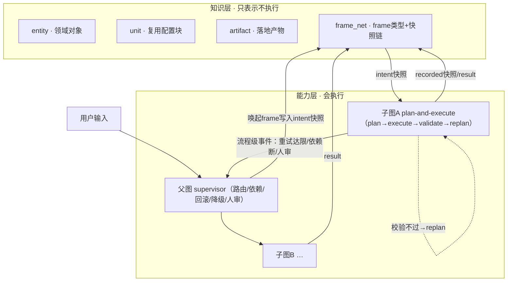
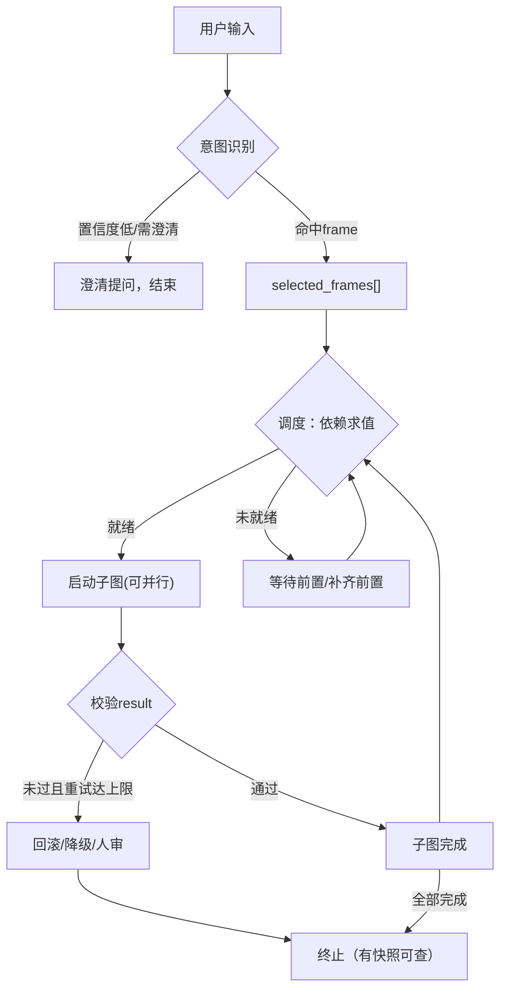

## 1. 设计目标与背景

本设计面向领域的Agent，旨在解决以下结构性问题：
- 意图多样性（不同事件要不同流程）：帧驱动、按序编排
- 新事件/新域的扩展成本：加schema=加能力，父图零改动
- 可观测与可审计（杜绝静默失败）：快照链=唯一事实源，终止必有记录
- 一致性问题（运行时与外部事实）：可推导不入State，状态(运行时)从快照链重建
- 知识演进与能力演进分离：frame边界让两边独立变化

*设计原则：*

1. *框架语义驱动：*
描述"意图如何构成"（frame schema + FE填充），LLM先按LU激活frame schema，
以FE填充产出结构化意图，而非自由文本任务单；意图结构由frame schema约束。

2. *描述与执行分离：*
描述"领域(domain)如何组织"（描述/执行边界 + React），frame是领域(domain)的边界，描述侧产出意图（frame快照）、执行侧回流结果（result）
React是描述→执行的可重入循环：

3. *知识即表示：*
描述"知识的形态"（entity/unit/artifact + frame_net），
entity（实体）/unit（复用单元）/artifact（产物）+frame_net（语义框架）皆为知识表示（陈述性+意向性），Agent/执行能力不在知识层内抽象。


4. *依赖显式化：* -->  P1：依赖声明在 schema 上，是 frame 固有语义（缺 required_deps/condition 就是 FE 约束的延伸）
数据依赖（前序result→本子图输入，required_deps）与控制依赖（条件满足才执行，condition条件边）必须显式声明，父图统一管理，禁止隐式耦合。

5. *事件快照审计：* --> P2：intent/result 本来就是跨边界流转的产物，append-only 是这条边界的派生要求
执行全程以只增不改的快照链记录（intent/recorded/failed/review/degraded五态），快照即数据，支撑校验/重试/回滚/审计和"计划vs结果"偏差。

6. *可靠性兜底：*
目标必达——优先重试，其次回滚，必要时降级（degraded态快照，链不中断），最坏人工介入（review闸），任何终止都有快照可查，杜绝静默失败。

7. *知识即表示：*
entity（实体）/unit（复用单元）/artifact（产物）+frame_net（语义框架）皆为知识表示（陈述性+意向性），Agent/执行能力不在知识层内抽象。

---

## 2. 总体架构

*本节目的：*给出知识层与能力层的两层全景，定义各层职责、frame边界衔接方式、数据主链路与父图介入时机，为后续各节提供框架定位。
*解决的问题：*确立"哪些是知识、哪些是能力、两者如何衔接"的整体视图，避免后续讨论脱离上下文；也回答"父图何时介入"这一编排问题的边界。

*两层视野：知识层与能力层：*
知识层只表示、不执行；能力层会执行。二者以frame边界衔接：意图（intent快照）从能力层写入frame，结果（result）经执行回写frame。
*为什么必须分离：*执行能力（如何跑）与领域知识（是什么）变化频率与演进主体不同——知识随领域扩展而改变，能力随工程需求而迭代，耦合则一处变更牵动全局；分离后frame边界成为两者的唯一协议面，允许知识层与能力层独立演进（原则7知识即表示、原则1–2描述/执行分离落于此）。



知识层四层（仅表示，不执行）：

| 泛化层 | 门禁域实例 | 表达 |
|---|---|---|
| entity | 产品/版本/代码仓 | 领域对象（陈述性） |
| unit | config-unit（CIE配置单元） | 复用配置块（陈述性） |
| artifact | 门禁物理文件（.yml） | 落地产物（陈述性） |
| frame_net | create门禁frame+快照链 | 意向记录（意向性） |

能力层两个角色：

*父图 supervisor：*
按意图识别结果选子图；声明并管理数据/控制依赖；子图收敛失败时回滚/降级/转人工；设人工介入闸；跨子图重排。

*子图 plan-and-execute：*
单事件处理单元，planner按frame schema生成intent快照→执行器纯函数→校验→replan循环，局部失败在子图内自愈。

*数据主链路：*
用户输入→父图意图识别（唤起frame）→intent快照→子图执行→result回写→recorded快照→父图校验→过则结束/不过则重试或回滚。

父图介入时机（子图未能自愈时父方才接管）：
*为什么必须后置介入：*子图内replan自愈是局部最小代价的修复（原则3组织轴），父图过早介入会把单点执行问题提升为全局调度问题——父图成为瓶颈、丢失子图局部循环的收敛能力；仅在子图确定的收敛能力耗尽时才接管，保证失败处理总是"先局部后全局"。

| 触发信号 | 介入时机 | 父图动作 |
|---|---|---|
| 意图不确定 | 输入识别置信度低/多意图需拆解 | 澄清提问或拆成多个子图 |
| 前置不满足 | 子图condition不成立 | 跳过子图(degraded)/换子图/先补齐前置子图 |
| 子图内收敛失败 | 子图replan重试达上限仍不通过 | 回滚到prev_round/降级/转人工 |
| 数据依赖断链 | 前序子图失败，本子图输入缺失 | 重跑/重排前序→或整体告警人审 |
| 人工介入闸 | 流程预约的评审点（即使校验通过） | 挂起等待人工放行（review） |

---

## 3. 全局状态设计（AgentState）

*本节目的：*定义AgentState"装什么、不装什么、父图与子图如何访问"，并把快照（持久化事实记录）与运行时可变上下文区分开。
*解决的问题：*回答"运行时状态里到底该放什么"——避免把可推导数据放入状态造成双写、审计失真与并发问题，同时明确子图的数据来源。

*定位先行：快照≠AgentState：*
快照（frame_net里，持久化、只增不改）与AgentState（运行时、可变）是两回事：
- Frame快照是持久化事实记录（append-only）——审计/回滚依赖它（原则5）；
- AgentState是运行时可变上下文——本轮执行临时持有，帮父图/子图传递上下文，完成即更新快照。
*为什么必须分开：*两者的生命周期与恢复语义完全不同——快照要跨崩溃/跨轮存活且只增不改（事实），State只在一轮内有效且可丢弃（视图）。若合并，要么把可变视图错误地持久化（破坏事实的不可变审计），要么把事实丢进可变态（崩溃即失真）；分开后State可从快照链整体重建（6.5.1），事实与视图各得其位。

设计准则：只装"编排需要但不算事实"的信息，事实一律进快照，避免把运行时状态当成知识层数据。

*State设计观点：可推导的不入状态：*
可计算的字段分两种：
- 可推导（derivable）：能从其它状态确定性重算、结果稳定，不应纳入状态。
- 可生成（generatable）：LLM输出、执行结果、时序信息，非确定、不可重算，必须纳入状态（或进快照）。

判定结论：可推导的不入状态；可生成的才入状态。若违反，则造成状态与真相源双写、审计失真。

*收益：*
- 单一源：State只是快照链的派生视图，杜绝"State与快照不一致"。
- 崩溃即可恢复：State无需持久化，从frame_net快照链重建，事实全在快照、算子全在State。
- 审计一致性：任何"当时"的intent/result都以快照为准，偏差才有据可查。
- State极薄：传参小、易调试、易并发（只读快照+轻量运行时态）。
- 脏读/幻读在结构上不可达：可推导不入状态使AgentState只含父图编排字段，子图需要的数据（intent/prev result）全在不可变快照链，子图不接触共享可变State，并发一致性问题由数据结构天然排除，无需锁或访问控制。

*成本与边界（需妥协）：*
- 重算成本：可推导≠免费，频繁重算会重复IO。妥协：派生字段可入State作缓存，但必须标注derived并声明推导源，不与之双写。
- 不可重现字段漏放：LLM意图产出不可推导，过度剔除会丢失描述侧原始事实。妥协：识别产物入State，同frame内容进intent快照。
- 外部世界真相：result是执行真实产出，无法从State推导。妥协：result只进快照，State只存引用。

*AgentState（单一源=frame_net快照链）：*

| 字段 | 归处 | 说明 |
|---|---|---|
| stage | 入State | 控制流指针，非导出值 |
| intent | 入State | 识别产物（LLM非确定），同frame内容进intent快照 |
| selected_frames[] | 入State | 多事件路由依据 |
| parent_ctx | pipeline_id入State | 依赖推导结果不入，现算 |
| snapshot_index | derived缓存 | round/phase/prev_round，声明推导源=快照链 |
| control | defer_to_human入State | retry/condition不入，现算 |

*子图与AgentState的交互规则：*
子图不直接读写AgentState；子图的数据输入一律来自快照链（intent/result引用），AgentState仅在父图内读写（父图是唯一写者）。此规则是对"可推导不入状态"的落实而非权限拦截——子图所需数据本不在AgentState内，问题由数据结构天然排除，无需并发锁或访问控制。

---

## 4. 子图节点与依赖关系定义

*本节目的：*定义"子图从哪来"（frame映射而非静态登记）与"依赖写在哪、怎么求值"（schema声明侧），把节点与依赖的方法论定下来。
*解决的问题：*避免子图登记表与frame库两处漂移，杜绝依赖隐式耦合；明确数据/控制依赖的落点与求值时机，为父图调度（第5节）提供声明基础。

*4.1 子图节点列表（父图视角）——映射规则：*子图节点并非静态登记表，而是由frame_net中某frame schema映射的执行单元：
- 子图类型=frame类型（frame_id唯一对应一个子图类型）
- 子图实例=frame实例（frame_instance_id唯一对应一次执行）
- 子图列表不硬编码，由意图识别结果动态决定（selected_frames[]即子图清单）
- 新增事件=新增frame schema，不改子图注册逻辑

*收益：*
- 新增事件零编排改动：加frame schema即获得可执行子图；
- 一人一frame一子图：frame_id即契约，子图输入结构由schema约束，无二义；
- 子图簇与知识层frame一致：意图识别→selected_frames→子图清单，链路单一，杜绝"登记表"与"frame库"两处维护漂移。

*4.2 依赖关系定义——声明侧：*依赖写在frame schema字段上（声明），父图读取后求值（行为）：
*为什么必须声明在schema而非父图硬编码：*依赖是frame的固有语义（它需要什么、何时才能跑），属于知识层；父图只负责读声明求值。若硬编码在父图，新增frame时父图必须改逻辑，破坏"新增事件零编排改动"（4.1）——依赖随schema新增即获得，父图无需感知具体依赖。

*数据依赖（前序输出→后续输入）：*
- 落点：frame的required_deps字段，值为前序frame类型的result引用（类型级，如quality_gate_compile_schema.result）；
- 实例由父图运行时解析：required_deps声明依赖哪个类型的结果，父图在快照链中找到该类型最近的recorded实例作为输入；
- 不声明实例id，父图按类型+最近顺序解析，避免实例耦合。

*控制依赖（条件满足才执行）：*
- 落点：frame的condition（可求值表达式/领域谓词，如branch_created(patient)==true）+ condition_desc（自然语义，仅供人读，不参与判定）；
- 父图在子图启动前对condition求值，条件不成立→跳过(degraded)/换子图/先补齐前置（行为见第2节介入时机表）。

*与第2节介入时机表的关系：*本节约定依赖在schema层面的声明格式与求值方式（声明侧），第2节介入时机表描述求值结果触发的父图行为（行为侧）。声明侧与行为侧双向对应："前置不满足"→condition求值不成立，"数据依赖断链"→required_deps引用缺失。

---

## 5. 父图动态编排逻辑

*本节目的：*父图动态编排解决"多事件、多子图场景下，如何把意图清单转化为可执行调度，并在满足数据/控制依赖的前提下推动全部子图收敛"，即回答：运行时选哪个子图、何时启动、并行还是串行、失败后下一跳是谁。本节只描述控制流（推进机制），不锁死阶段枚举，不重复依赖声明（第4节）与介入时机（第2节）。

*5.1 编排主循环：*
```
开始 → 意图识别（用户输入 → 置信度?）
  置信度低/需澄清 → 澄清提问，结束本轮
  命中frame → selected_frames[]（多事件清单）
         ↓
调度（依赖求值）
  取就绪子图集合：required_deps已满足 且 condition求值成立
  未就绪子图：等待其前置子图result，或插入补齐前置
         ↓
启动就绪子图（可并行，受依赖约束）
  父图写intent快照 → 子图 plan→execute→validate→replan（子图内自愈）
         ↓
校验（result回写recorded快照，父图校验）
  通过 → 子图完成，释放后续子图依赖
  未过 → 重试仍达上限 → 回滚/降级/人审
         ↓
所有子图完成 / 任一子图转人工 → 本轮终止
```

*5.2 state推进机制（与AgentState的stage逻辑一致，不锁定枚举）：*
- 意图识别写selected_frames，父图维护"已就绪"与"待依赖"两个队列；
- 子图执行期间由子图自身推进其局部循环，父图只在其回传时更新全局stage；
  *为什么必须：*子图局部循环的中间态对父图是黑盒（原则2/3分工），父图若持续感知子图内部推进会强耦合并在每粒度上做同步处理；父图只在子图收敛/失败的回传边界更新stage，保证父图以事件驱动、低耦合推进编排（呼应介入时机"只管边界不管内部"）。
- 校验、调度、人审等父图动作逐一推进stage，全部结束置terminated。

*5.3 动态演化（子图清单可变）：*
- 换子图：某子图重试达上限 → 父图换等价frame的子图（如有）；
- 补齐前置：required_deps缺失 → 插入前置子图为新节点；
- 回滚重排：回滚至prev_round → 需重跑的子图重新进入调度队列。
*为什么必须：*意图识别时的selected_frames是"规划"推断，依赖图在运行时可能暴露缺失（前置未造）或失效（某子图不可收敛）——静态清单无法承载这些运行期发现；动态演化使父图能调整执行计划，但每次调整仍以快照记录（6.5），保证"计划偏离"可审计，而非无序改动。

*5.4 并行与依赖约束：*
允许并行，但严格按依赖图拓扑推进：无依赖关系的子图可并行，有依赖关系的子图必须按序（前序result落快照后，后续子图才满足required_deps）。并行度由依赖图决定，不由父图预设。
*为什么必须由依赖图决定：*并行度是依赖关系的导出性质而非独立配置——若由父图预设并发数，则预设可能与声明依赖冲突（如图上仍有依赖链却并行启动）或落后于schema演化（新依赖加入后旧预设失效）；由依赖图推导，并行天然正确且随schema自动变化，父图无需维护并行配置（同样受益于第4节的声明侧）。

*流程图：*



---

## 6. 可靠性保障机制

*本节目的：*落地执行可靠性与目标必达：定义成功校验标准、重试边界、失败处理策略，并覆盖知识层表示与真实环境之间的一致性问题，杜绝静默失败。
*解决的问题：*回答"子图失败时怎么办"——何种算成功、重试几次、回滚/降级/人审如何取舍、最坏情况如何收尾；以及"记录的 vs 真实存在的"不一致时如何检测与收敛。

*6.1 成功校验：*

*三层校验（为什么按此分层：产出校验验证结果存在性与可指向性，语义校验验证结果符合schema契约，一致性校验验证与真实环境相符——三者覆盖"成果存在、格式正确、内容真实"）：*
- 产出校验：result是否填充，且指向真实存在的artifact实例（artifact为泛化对象，具体形态由frame领域实例定义：门禁域为物理文件，其他域可为其他产物）；
- 语义校验：FE枚举约束合法性（候选集内），由执行器纯函数随result返回{ok, evidence}，不引LLM与谓词引擎，可单元测试；
- 一致性校验：非阻断式（陈旧数据检测/告警，见6.5.2），仅写外部成果前做CAS强校验。

*分层归责：*
- 子图内：产出校验+语义校验，失败→replan自愈（原则2执行侧）；
- 父图：跨子图一致性校验与前置目标达成校验（依赖图推进依据）。

*判定：*三层全过→recorded落盘→释放后续子图依赖；任一不过→不算成功，进入重试（6.2）。

*校验元信息：*result快照携带evidence（校验版本号、比对结果），作为"计划vs结果"审计载体。

*6.2 重试机制：*

*两级重试（为什么：原则3组织轴——局部失败局部自愈，父图不介入可自愈的子图，避免父图成为瓶颈）：*
- 子图内replan：单步执行失败后的迭代（plan→execute→validate→replan），目标=自愈，父图不干预；
- 父图级介入：子图整体未收敛时决定重跑/换子图/回滚/降级/人审。

*子图内止损（为什么：保证重试可终止性，否则死循环且无收益）：*
- 判据="结果不改善"：同读快照下replan后result与上轮相同→判定停滞→上报父图；
- 兜底=最大次数上限（停滞判定失效时的保护机制）。

*强制幂等（为什么：重试安全的基础，否则每次重试产生重复artifact/副作用，审计与回滚都失真）：*
执行器纯函数，同读快照下重复执行产出相同result，不产生重复artifact（衔接6.5.1幂等承诺）。

*读快照语义（为什么：基于快照隔离执行，保证重试可复现性——同读快照下固定输入，重试前后仅执行计划可变，停滞判定可归因、外部世界漂移不污染对比）：*
子图内replan沿用首次读快照；失败归因世界或停滞→交父图重取读快照/重排/回滚（新一轮=新快照实例）。

*失败归因（决定沿用快照重试是否有意义）：*

| 失败类型 | 例子 | 沿用读快照重试 | 处理 |
|---|---|---|---|
| 执行/生成失败 | plan选错参数、产物不合FE枚举约束、执行器可修复错误 | 有意义——上下文未变，重试是修正执行本身 | 子图内replan |
| 世界相关失败 | 陈旧数据、CAS冲突、依赖断链 | 无意义——基于旧快照无法通过校验 | 上报父图：重取读快照/重排/回滚 |

*retry_index（为什么：审计"为何重试、第几次重试"，"计划vs结果"偏差可追溯）：*
metadata标注retry_index。

*6.3 失败处理：*

*6.3.1 失败分类（处置的依据）：*
*为什么必须分类：*失败原因不同，正确处置不同——跳过/降级/回滚/人工是四条互斥路径，混淆会导致"该降级时回滚、该人工时降级"的误处置；分类使处置判定可编译、可测试。

| 分类 | 判定依据 | 处置 |
|---|---|---|
| 可跳过 | 条件不适用（condition不成立，非失败） | 标注skip，不占用degraded |
| 可降级 | 存在schema声明的降级路径 | 降级执行（degraded态） |
| 可回滚 | 无降级路径且有可回滚前置 | 回滚prev_round重排 |
| 必转人工 | 上述皆不可 / 人审闸 | review等待放行 |

*6.3.2 降级（嵌入的一类处置）：*
*为什么需要降级：*原则6"目标必达"要求完整达成与失败之间有带证据的中间路径——不可抗限制（上游部分缺失、外部短暂不可用）下，降级达成优于两档跳变（失败/回滚）；降级产物同样过校验（6.1），链不中断、可审计。

三条红线：
- 降级对象是执行方式，不是校验标准——为什么必须：校验标准是frame契约，可降级则门禁形同虚设；
- 降级路径必须schema声明（admissible）——为什么必须：父图无权发明降级，无声明降级路径→只能回滚/人工；
- 跳过与降级分离——为什么必须：condition不成立是"不适用"而非"降级"，共态会污染审计。

*6.3.3 失败处置总则：*
处置优先级：重试→降级→回滚→人工。
*为什么按此序：*重试成本最低且可复现（6.2）；降级保链不断；回滚使状态重新一致；人工是最后兜底——越靠后的路径副作用越大、越不可逆，因此越晚使用。
任一终止都有快照可查（原则6），杜绝静默失败。

*6.4 目标必达保证：*

*本节定位：*6.1–6.3 回答"每种失败怎么处理"（达成路径），6.4 回答"什么算达成、什么算违反承诺"（达成判定），6.5 提供"达成的证据"（快照链）——本节是判定层，不叠加新处置机制。

*正当终态定义（达成判定）：*任何一次执行只能以正当终态结束，否则视为违反承诺。

| 终态 | 含义 | 是否"达成" |
|---|---|---|
| success | 校验全过，recorded | 达成 |
| degraded | 降级达成，链不断 | 达成（带证据） |
| review | 移交人工 | 达成（移交责任） |
| failed | 重试/降级均不可达，终止 | 达成（若已完整快照+告警） |

*为什么必须定义正当终态集合：*"必达"易被误解为"必须成功"。不定义集合，"降级/转人工"会被误判为失败，而真正的违规（静默失败）反而无判定依据。

*唯一违规红线：静默失败。*唯一不允许的终态是"无快照、无证据、无告警"的终止。
*为什么必须是唯一红线：*多设红线会稀释承诺。快照链（6.5）保证"终止必有快照"，红线即验收标准，可测。

*目标必达是"移交"不是"放弃"：*转人工时任务责任移交人工而非丢弃，父图挂起等待放行，放行后从快照链恢复续跑。
*为什么必须：*否则"人工介入"只是失败的别名，目标必达退化为"可放弃"。正因≠放弃，重试/降级/人工才构成完整谱系。

*补充说明（用户主动中止）：*用户主动取消/中止执行时，同样必须落 review/failed 等明确终态并保留快照，保证"被打断的执行"仍可审计；父图不得绕过快照链直接丢弃执行上下文。

*6.5 写边界一致性：*

*本节定位：*执行过程中存在两类"写"——写入快照链（内部）与写真实环境（外部）。真实环境我们无法拿到其一致性模型，故外部的共享状态不受我们约束，一致性只能靠"读快照+版本比对"在边界上保证，而不是在共享状态上加锁。

*6.5.1 内部写边界一致性：*
- 快照写入原子性：intent/result 落盘为单次原子写，杜绝部分写入；
  *为什么必须：*快照是只增不改的持久化事实记录（原则5），半写会使链中出现"无intent的result"等不可判定记录，破坏审计与回滚的完整性。
- 幂等性：重试/回滚不产生重复快照与重复物理成果（执行层纯函数+一致读快照保证）；
  *为什么必须：*重试与回滚都要重放执行（6.2），若重复生效，则快照链与真实环境双膨胀，审计到的"计划vs结果"失真。
- 回滚链处理：回滚至 prev_round 后旧链标记 deprecated（不删除），新链续写；
  *为什么必须：*链只增不改（原则5），删除旧链破坏审计；deprecated 标记保留"曾发生"事实，同时让 prev_round 解析避开已废弃轮。
- State重建：崩溃恢复时由 frame_net 快照链重建 State，杜绝双写偏差。
  *为什么必须：*State 是可推导的运行时视图（第3节），从唯一事实源重建才能保证崩溃后 State 与快照一致，否则两处状态会漂移。

*6.5.2 外部世界一致性（知识层表示 vs 真实环境）：*
知识层是真实环境（如代码仓）的陈旧数据（stale data）表示，允许滞后但须可检测、可刷新、不危害决策：
- 陈旧数据检测与刷新（stale-detection & refresh）：读取时可与真实环境比对版本，发现陈旧则刷新记录，再用于决策；
  *为什么必须：*知识层是真实环境某一时刻的表示，真实环境会被外部无约束修改（如并行流水线），不检测则陈旧表示会流向决策（6.1一致性校验），产生错误执行。
- 一致读（consistent read）：执行器读取外部世界时取一致读快照（快照版本号），执行全程基于该读快照，不随外部变化漂移；
  *为什么必须：*执行中途外部变更若无版本锚定，同一执行会读到"前后不一致"的世界视图，结果不可复现、无法归因（呼应6.2快照隔离）。
- CAS校验（compare-and-set）：写物理成果/result前，将读快照版本与真实环境现版本比对，版本未变才提交，变了则重取读快照重执行；
  *为什么必须：*写前比对是"外部世界一致性"的唯一强校验点（6.1），若不校验，基于陈旧读快照的写入会覆盖他人最新变更（丢失更新）。
- 乐观并发控制（OCC）：子图间/与真实环境的并发写入以版本冲突检测而非加锁解决，冲突即触发重取+重执行。
  *为什么必须：*真实环境无法加锁（外部无 MVCC 给我们），加锁也违背读取的最小侵入；冲突检测允许并行执行，仅在提交时处理冲突，符合"只在一个强校验点"的一致性原则。

---

## 7. 执行流程示例
*本节目的：*用一个端到端例子把前述架构、状态、编排、可靠性串起来，验证设计自洽并给出落地参考。
*解决的问题：*回答"这套设计跑一次真实需求长什么样"——意图如何变成子图清单、依赖如何满足、失败如何兜底，便于发现环节衔接的遗漏。

以用户查询"搭建分布式25a的门禁"为例：

*主路径：*

| 步骤 | 内容 | 验证点 |
|---|---|---|
| 1 | 意图识别：唤起create_quality_gate frame并填充FE（config_unit=distributed_25a），selected_frames=[create_quality_gate] | 原则1帧语义与FE槽位约束、selected_frames=frame实例清单（4.1） |
| 2 | 写intent快照：intent=frame实例+FE值 | 快照≠AgentState（第3节） |
| 3 | 依赖调度：无前置required_deps，condition求值通过→就绪 | 4.2控制依赖求值 |
| 4 | 启动子图create_quality_gate：plan→execute→validate | 6.1语义校验（FE枚举）、evidence |
| 5 | 写外部成果：CAS版本比对通过 | 6.5.2防丢失更新 |
| 6 | recorded落盘：释放后续依赖 | 6.1/5.1收敛 |

*分支1（执行/生成失败）：*步骤5前校验未过→replan循环（6.2），沿用读快照重试，停滞则上报父图。
*分支2（外部世界CAS冲突）：*步骤6版本比对失败→重取读快照重执行（6.5.2/OCC）。
*为什么示例取主路径+这两个分支：*它们分别覆盖可靠性两个独立维度——分支1验证"执行层自愈"（6.2/6.3），分支2验证"外部世界一致性"（6.5.2）；合并即覆盖"读快照+版本比对+快照链证据"的主链路闭环，足以承载"端到端自洽"的验证目标，其余细分（降级、人审）已在6.3.2/6.3.3单独论述，避免示例过度展开。
*终态：*success落recorded，返回门禁artifact引用；任一失败走6.3分类处置，绝不静默失败（6.4）。


---

## 8. 扩展性与维护性

*本节目的：*说明新事件/新领域如何低成本接入，明确变更与维护边界。
*解决的问题：*回答"这套设计的成长性"——新增frame schema即新增子图，依赖走schema声明，编排/状态免改造，新旧知识如何共存。

*扩展场景：*

| 场景 | 变化 | 已有支持 | 收束：必须这样设计的原因 |
|---|---|---|---|
| A 新事件 | 新增frame schema（如commit_quality_gate） | 4.1：新schema→新子图，免编排改动 | 子图清单由意图识别动态决定（不硬编码），新增事件即新增schema，父图无需感知：可扩展性是"不感知"而非"适配" |
| B 新领域 | 新增frame簇（如流水线构建域） | 知识层四层泛化、frame全局注册 | 父图是全局的：frame注册后父图即可调起，无域级父图；框架类型级引用跨域成立——因为实体/产物跨域共享（同一code_repo），跨域依赖是自然的，全局父图+全局注册使新域接入成本=注册成本 |
| C 依赖演化 | 已有frame的required_deps/condition变更 | 4.2声明侧：改schema | schema必须版本化：实例绑定创建时版本，行为按当前版本求值——否则"快照支持回滚"在schema变更后失真（旧实例按新schema求值会错判），版本化保住审计与回滚的语义正确 |

*变更与维护边界：*新增frame/schema为正向扩展，不动编排与状态；schema变更走版本化，不动历史实例；跨域新增成本=注册成本。维护边界=知识层（schema）而非能力层（父图/子图），故成长性由知识层承载。

---

## 9. 总结

*本节目的：*收束全篇，把核心决策、原则与各节要点压缩为可复核的结论。
*解决的问题：*回答"设计定了什么"——便于评审对齐与后续实现时快速回查。

*核心决策链：*
- 两级编排（组织轴，原则3）：父图=supervisor全局编排，子图=plan-and-execute局部自愈；父图只管家不管内部（5.2）。
- 知识层=表示、能力层=执行，frame为边界（原则1/2/7）：意图与结果都通过frame快照流转。
- 状态极薄：可推导不入AgentState，事实全在只增不改的快照链（第3节）——由此结构性排除脏读/幻读。
- 依赖显式化：required_deps（数据）/condition（控制）声明在frame schema，父图读声明求值（第4节），并行度由依赖图推导（5.4）。
- 可靠性分级：校验（6.1）→重试（6.2）→降级/回滚/人工（6.3），正当终态统一判定（6.4）；消化一致性与幂等的写边界规则（6.5）。
- 扩展零改造：新事件=新schema、新领域=全局框架注册、依赖演化=schema版本化（第8节），维护边界在知识层。

*一句话：*以frame为知识边界、父图编排+子图自愈、快照链作唯一事实源，换取意图多样性的灵活编排与可审计的目标必达；知识层承担成长性，能力层承担确定性。

