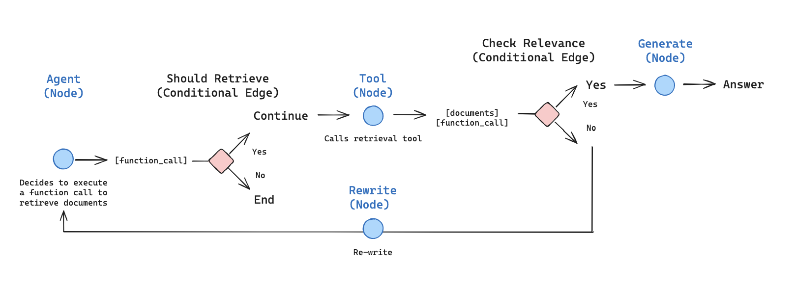

# Agentic RAG


## FAQ
**1. load_dotenv()在三方库导入后执行导致环境变量获取失败**
Ⅰ. 某些三方库（如 langchain_community 的文档加载器 WebBaseLoader 等）导入时会进行环境变量校验

**2. 倒排索引的⌈倒排⌋如何理解**
Ⅰ. 逻辑颠倒，即正排索引由文档找词、而倒排索引是由词找文档

**3. RAG中召回的是什么？**
Ⅰ. 召回出来的核心内容是分割后的⌈文档文本块（Chunks）⌋
Ⅱ. 业务形式：召回的是⌈“半结构化/多模态知识”⌋“参考资料”
Ⅲ. 数据形式：召回的是⌈以结构化对象为载体，封装文本内容与多维元数据⌋“原始文本 + 元数据”

**4. 编码和建立向量索引的作用对象是什么**
Ⅰ. 编码和建立向量索引阶段的作用对象是Chunks（分块）

**5. 分块大小按 ⌈字符⌋ 或者 ⌈token计数⌋的区别和影响是什么**
Ⅰ. 两种计数方式的本质区别在于计量单位不同，字符按可见字符计、token按模型词表子词切分计，同一段文本的字符数≠token数（如1个汉字=1字符但可能=2-3个tokens）

Ⅱ. 分块大小直接影响上下文窗口利用率，即同样的chunk_size值，字符计数占用更多tokens，可能超出模型窗口上限导致截断或调用失败

```python
from langchain_text_splitters import RecursiveCharacterTextSplitter
import tiktoken
from langchain_text_splitters import RecursiveCharacterTextSplitter

text = "人工智能与大语言模型"

print(f"字符数: {len(text)}")  # 10

enc = tiktoken.get_encoding("cl100k_base")

print(f"token数: {len(enc.encode(text))}")  # 通常 > 10

splitter = RecursiveCharacterTextSplitter(chunk_size=5, chunk_overlap=0)
print(f"按字符(chunk_size=5)分块: {splitter.split_text(text)}")
# ['人工智能与大', '语言模型']

splitter_tik = RecursiveCharacterTextSplitter.from_tiktoken_encoder(chunk_size=5, chunk_overlap=0)
print(f"按token(chunk_size=5)分块: {splitter_tik.split_text(text)}")
# 实际分块数更少，因为10字符文本的token数可能仅6-8
```

**6. 文档内容编码和召回工具设计为装饰器还是参数传递**
装饰器调试困难（中间结果不可见）、嵌套地狱、不适合RAG这种需要多分支场景

**7. Embedding模型只需第一次运行时下载？网络原因导致模型下载失败怎么处理？**
Ⅰ. 模型只需首次下载、后续运行直接从缓存加载（~/.cache/huggingface/hub/（Windows: C:\Users\用户名\.cache\huggingface\hub\）

Ⅱ. 降级处理，配置HF国内镜像 > 手动离线下载模型 > 无需网络的纯本地embedding

```Python
# FakeEmbeddings生成随机向量，召回无语义相关性，仅用于验证流程，不可用于生产
from langchain_community.embeddings import FakeEmbeddings
embedding = FakeEmbeddings(size=384)  # 随机向量，仅用于调试流程
```

**8. init_chat_model()在langchain的什么版本引入？**
langchain >= 0.2.8、升级命令：

```Python
pip install -U langchain langchain-core langchain-openai

```

**9. .env怎么配置结构化数据格式(例如json)？**
不建议使用 .env适配该场景

**10. oepncode的opencode.josn文件是否适用于langchain的init_chat_model()**
Ⅰ. 两者⌈Schema结构⌋完全不同，即init_chat_model()接收的是标准的独立关键字参数，或者接收由对应大模型厂商官方包（如langchain-openai、langchain-anthropic）定义的特定参数格式
```Python
@overload
def init_chat_model(  # type: ignore[overload-overlap]
    model: str,
    *,
    model_provider: Optional[str] = None,
    configurable_fields: Literal[None] = None,
    config_prefix: Optional[str] = None,
    **kwargs: Any,
) -> BaseChatModel: ...
```

**11. 怎么提取异构⌈Schema结构⌋的交集**
Ⅰ. Pydantic有⌈忽略未知字段⌋策略、即从 .json/...等数据源提取Pydantic模型定义的数据
```Python
from pathlib import Path
from pydantic import BaseModel, Field, ConfigDict
from langchain.chat_models import init_chat_model

# 定义Pydantic模型，只提取OpenCode中LangChain关心的字段
class OpenCodeModelConfig(BaseModel):
    # 核心：使用extra="ignore" 自动忽略 opencode.json 里的快捷键、UI 等杂七杂八的配置
    model_config = ConfigDict(extra="ignore")
    
    # 提取默认模型名称 (例如 "anthropic/claude-sonnet-4-5")
    model_name: str = Field(..., alias="model")

```

**12. Path读取Win环境路径：unicode error**
Ⅰ. 反斜杠 \ 是转义字符, 即代表一个8位的Unicode字符转义序列
Ⅱ. r是原始字符串（Raw String）的缩写，即r后的字符串会被当作普通文本处理
```Python

# 原
config_path = config_path or Path("C:\Users\xxx\config\opencode\opencode.json")

# 改
config_path = config_path or Path(r"C:\Users\xxx\config\opencode\opencode.json")

```

**13. 对于LiteLLM为什么OpenCode支持，而LangChain却不纳入核心**
Ⅰ. LiteLLM的定位是⌈模型网关⌋、属于**模型调用的提供者**，即**作为代理来路由多模型**、对外提供请求路由、成本统计、负载均衡等能力。

Ⅱ. OpenCode定位是一个⌈终端AI编程工具/客户端⌋、属于**模型调用的消费者**。自身只维护一套provider接入层（OpenAI 兼容协议为主），接入LiteLLM网关几乎零成本。

Ⅲ. LangChain定位是⌈企业级的底层开发框架⌋、同在模型调用的消费侧。但对provider的接入处理策略不同：LangChain选择原生直连各供应商。

从接入模型成本来看，OpenCode自身没有模型抽象层，逐家自建100+集成成本过高，委托网关是最优解；
而LangChain的BaseChatModel抽象 + partner packages（langchain-openai、langchain-anthropic…）降低集成成本。它虽也能消费LiteLLM网关（如ChatLiteLLM/ OpenAI兼容端点指向网关），但为避免额外一跳的延迟、故障点以及功能被网关截断（流式、工具调用、结构化输出保真），所以不纳入核心。

**14. Agent的记忆与业务落地：修改OpenCode还是基于LangChain自研？**
Ⅰ. 记忆是⌈生物/机器编码、存储、检索信息的能力

Ⅱ. 记忆的一个重要功能是帮助确保Agent的**行为符合当前情景（上下文）、并根据经验(短期、长期记忆)进行调整**。[引用](https://www.psychologytoday.com/us/basics/memory/how-memory-works)

Ⅲ. 记忆是Agent**理解业务**的基础设施

将opencode作为langchain的一个工具节点负责执行，litellm进行模型路由

**15. 如何验证RAG效果**
Ⅰ.POC
从最简架构和默认参数开始，先跑通流程拿到**基线数据**，再开始有针对性的优化。

**评估embedding的指标是什么**
[参考](https://zilliz.com.cn/blog/Vector-Database-POC-Guide-Embedding-Model-Selection)

**16. LangChain的向量存储是什么？**
Ⅰ. 指集成层？集成了什么？

**17.向量模型输出的是什么？存在哪里？**
**18.向量模型有哪些？怎么选?**
**19.模型不可用时，降级机制怎么实现**
**20.LangChain的embedding源怎么配置**
**21.RAG的效果受文档质量影响，那怎么反向通过AI生成好的文档**
以下为AI参考回答
```
不是"AI 凭空造文档"，而是用 AI 做清洗、结构化、增强：
1. 清洗：去噪、去 HTML、合并断行、纠正 OCR/格式错误
2. 结构化：加标题层级、表格化、提取元数据（来源/日期/主题）
3. 语义补全：把"这里/前文"等指代替换为明确实体
4. chunk 友好：按语义边界切分，保证每个 chunk 自包含、可独立理解
5. 生成 Q&A 对：为每段生成"问题-答案"对，做 query 侧增强
6. 摘要/关键词标注：为 chunk 加摘要字段，辅助检索排序
```

**22.好的文档的评估指标是什么**
Ⅰ.
Ⅱ.

以下为AI参考回答
```
- 检索侧（找得准不准）：Recall、Precision、Hit Rate、MRR、nDCG
- 生成侧（答得好不好）：Faithfulness（忠实度）、Answer Relevancy（答案相关性）、Context Relevancy（上下文相关性）— 常用 RAGAS 框架统一评测
- 文档本身：结构完整性、chunk 语义自包含度、指代消解率、信息密度（无冗余/无歧义）、可追溯性
```

以下为AI评估一段内容是否为好的文档
```
客观辩证评估：这段属于"有价值的草稿"，但还不是合格的文档段落，直接作为 RAG chunk 会降低检索与生成质量。
优点（保留价值）
- 有分类意识：明确用"语义记忆"这个抽象层次，并给出"是什么""信息量→博学"的洞察，认知框架是对的
- 有通俗类比（"信息量越大 AI 越博学"），降低了理解门槛
- 列表式结构，比纯散文更利于机器切分与检索
问题（阻碍成为"好文档"）
1. 结构断裂/未闭合：标题是"记忆分类"，但只写了语义记忆就戛然而止，缺情节记忆、程序记忆等并列项 → chunk 不完整、不满足"自包含"
2. 占位符残留：语义记忆描述xxx"是什么" 中的 xxx 未替换，属于未完成内容，会直接污染检索结果
3. 符号错配：⌈知识⌋ 括号不配对（应为「知识」或"知识"），全/半角标点混用（⌈知识⌋、空格"事实、概念"）
4. 序号层级混乱：1. 与 Ⅰ. Ⅱ. Ⅲ. 混用，Ⅱ、Ⅲ 本质是"知识"的展开，却挂在"信息量"（Ⅰ）的平级下，逻辑层级错乱
5. 指代与冗余：Ⅱ 定义"知识"，Ⅲ 又回到"语义记忆"，中间缺过渡，信息密度被稀释；⌈泛化表现⌋ 一词突兀未解释
结论
- 作为草稿/素材：合格，有可提炼的观点
- 作为RAG 文档段落：不合格，违反"结构完整、chunk 自包含、无指代/占位符、格式规范"四条核心标准
修改方向（示例）
## 记忆分类：语义记忆
语义记忆是长期积累的知识，用于解释 Agent 输入"是什么"。
- 核心指标：信息量（信息量越大，AI 越博学）
- 知识：事实、概念的含义及其关联，是构成其他记忆的基本单位
- 语义记忆可描述无直接关联的事实与意义（如俚语含义）
补全其余记忆类型后，方可作为合格段落。
```

**23. pytest的测试命令**
1. 基础运行命令：
- 运行所有测试：直接在项目根目录下输入 pytest
- 指定文件运行：pytest test_login.py
- 指定目录运行：pytest tests/
- 指定函数运行：pytest test_login.py::test_user_login
- 指定类与方法：pytest test_login.py::TestClass::test_method

2. 常用控制台输出参数
- 详细输出模式：pytest -v（显示每个测试用例的详细结果）
- 简略输出模式：pytest -q（只显示关键结果，减少干扰）
- 打印捕获的标准输出：pytest -s（允许在测试时看到代码中的 print() 信息）
- 显示最慢的N个用例：pytest --durations=N（排查测试性能瓶颈）

3. 执行控制与筛选
- 按关键字筛选：pytest -k "login or logout"（运行名字包含相关词的用例）
- 按标签/标记筛选：pytest -m smoke（只运行被 @pytest.mark.smoke 标记的用例）遇
- 错即停：pytest -x（只要有一个用例失败，立即停止整个测试任务）
- 限制失败次数：pytest --maxfail=2（失败 2 次后停止测试）
- 失败重跑：pytest --lf（last failed，只运行上一次失败的用例）
- 从失败处开始：pytest --ff（failed first，先运行上次失败的，再运行其他的）

4. 调试与排查
- 失败时进入PDB调试：pytest --pdb（用例失败时自动断点，进入 Python 调试器）
- 查看已注册的 Markers：pytest --markers
- 查看已可用的 Fixtures：pytest --fixtures

**24. embedding模型的作用是什么？**
**25. 用户的原始问题会被embedding模型执行什么操作？处理后的内容是什么？**
**26. 原始文档会被embedding模型执行什么操作？处理后的内容是什么？**
**27. Pytest中的方法的名称有什么要求？**
Ⅰ.  Pytest会在指定的目录（未指定则默认为当前目录）下，按照「文件 -> 类 -> 函数/方法」 的层级，根据特定的命名规则自动寻找并执行测试
Ⅱ.  识别test_开头和_test结尾的**py文件**
Ⅲ. **类名**必须以 Test 开头，且不能有 __init__ 方法
Ⅳ. **函数名**必须以 test_ 开头
Ⅴ. **路径搜索优先级**, 显式指定（命令行写了路径（如 pytest tests/）） > 根目录配置文件（从当前目录开始，寻找pytest.ini、pyproject.toml或setup.cfg 等配置文件，并读取其中定义的 testpaths 路径） > 默认当前目录

**28. TypedDict和Pydantic区别是什么**
~~Ⅰ. TypedDict是Python**类型提示（Type Hints）字典**的一种结构，会被静态类型检查工具拦截检查~~
~~Ⅱ. TypedDict在代码运行时仍然是一个普通的Python普通字典~~

**29. LangChain中的消息合并机制有哪些？convert_to_messages()采取的是什么方式？**

**30. langchain_core只接受PromptValue/str/BaseMessage列表**
Ⅰ.`BaseChatModel.invoke()`及`_convert_input()`定义在langchain_core的抽象基类中，所有`BaseChatModel`子类(ChatOpenAI/ChatAnthropic/ChatGoogleGenerativeAI等)共用同一入参校验路径

Ⅱ.顶层入参契约是`LanguageModelInput = Union[PromptValue, str, Sequence[MessageLikeRepresentation]]`,裸dict不在其列，但列表内部的dict会被`convert_to_messages()`逐元素转成BaseMessage

Ⅲ.各厂商(partner包)只负责消息下游序列化为自家API格式，不参与该层入参类型校验

langchain_core在抽象基类层统一约束"PromptValue/str/BaseMessage列表"的入参契约，各厂商子类只做下游消息序列化而不改变该校验，因此该结论可跨模型厂商泛化使用

**31. Annotated是什么？**
Ⅰ.是Python类型提示(Type Hints)系统中的一个**通用元数据装饰器**——更准确说是**特殊形式(special form)类型构造器**，语句`Annotated[T, meta1, meta2, ...]`在类型T上附着任意元数据形成新类型，但**不改变T本身的类型语义**

Ⅱ."通用"指不依赖任何特定框架，各库均可自定义并读取元数据（如pydantic的`Field`/`AfterValidator`、FastAPI的`Query`/`Path`）；同时运行时`isinstance(x, T)`仍按原类型T判断

Ⅲ.元数据是任意对象的附加信息（字符串/枚举/函数/方法均可），可传多个，存于类型对象的`__metadata__`属性；它不参与类型约束，仅在消费方运行时按需读取

Ⅳ.装饰器——"装饰"体现为对类型做"包装+附加"，而非函数/类的`@装饰器`语法；读取时`get_type_hints()`默认剥离元数据，需`include_extras=True`，或直接访问`Annotated[T, meta].__metadata__`

Annotated的核心应用场景：数据校验(pydantic)、依赖注入(FastAPI)、运行时读取元数据(自省)、类型化文档；**本质是"类型T+附着信息"的单一声明点**，让类型系统与业务约束在同一处表达

**LangGraph示例**：`messages: Annotated[list[AnyMessage], add_messages]`中`T=list[AnyMessage]`、元数据为reducer函数`add_messages`——LangGraph通过`include_extras`读取`__metadata__`拿到合并策略(按消息id去重后追加)，即"类型声明+状态更新策略"绑定于同一声明点，属核心点Ⅲ的直接体现

------------分割线------------

## 附录

### 档案模板
语义角色标注(NLP工程落地)-框架语义学(方法论)；事实与推断分离的认识论设计

在语言学里的正式名称是框架语义学，而语义角色标注（Semantic Role Labeling, SRL）是把这套理论工程化的 NLP 任务

SRL；的核心价值：句法是表层排列，语义角色是事件的深层结构——前者怎么变，后者不变。

| CS 知识类型 | 例子 | 适配度 | 原因 |
|---|---|---|---|
| 事件型经验知识 | 线上事故、bug 复现、故障复盘 | **高** | 天然的事件—行动—结果结构 |
| 实验测量记录 | benchmark、ML 实验 | 中高 | 有观测与状态，但缺测量方法、复现次数槽 |
| 设计决策知识 | 架构选型（ADR 的领地） | 低 | 需要“备选方案/权衡/后果”，模板无此槽 |
| 命题型知识 | 复杂度、协议语义、API 契约 | 极低 | 无观测者无处置者，硬填即伪造事件 |
| 参考型文档 | 教程、手册 | 无 | 完全不同的体裁 |


```markdown
# 事件型经验知识
---
名 称： {name}
来 源： {source}
    {时间标记}, {观测主体} [在{空间上下文}] {观测行为} {观测对象}。
    {行动主体} [在{空间上下文}] {处置行为} {目标客体}，{客观状态}。
    {背景溯源}，{确切/存疑推论}。
<!--
说明：
1. [ ] 包裹为可选片段，无空间场景时直接删除该部分
2. 可重复追加上述事件单元，记录多段时序事件

功能分解：
| 句子 | 层次 | 作用 |
|---|---|---|
| 第一句 | **目击层** | 记录感知事件：谁、何时、（何地）、看见了什么 |
| 第二句 | **处置层** | 记录干预行为：谁做了什么、目标是什么、可验证的结果状态 |
| 第三句 | **解释层** | 认知评述：追溯来历 + 明确标注不确定性的推断 |

-->

模板提取来源原文：
>> 许多年前，雷达在大陆东南方向捕捉到不明飞行物坠落的信号。外勤小队在现场发现坠落的旧世界空间站逃生舱，其余关仓中的男人还活着。他自称是旧世界人类中极为罕见的存在，未经激发就拥有潜能，当年被称为异能者，曾是海拉帝国的实验对象。至于为何会在逃生艇中坠落至此，无门一无所知，也许时至今日在近地空间仍存在其他幸存者

模板应用示例：
....
---
**[壹•{特性}介绍]**
{特性主体}的{特性类别}较为{定性程度}，能使{作用域}{能力效果}。{确切/存疑推论}其能力与{确切机制/机制假说}有关，[然而{核心疑难}，现有{认知手段}尚无法揭示{未知机制}。{实证案例}的存在让我们意识到，当前对{所属领域}的认知{认知状态}]。
<!--
说明：

-->
模板提取来源原文：
>> 无门的潜能较为罕见，他能使自身以及所接触的物体穿越任何障碍物。推测其能力或许与生物电磁反应以及主动调控原子外电子云解除与重组有关，然而，生物体如何在原子级别实现如此精细的操控，现有技术尚无法揭示其真正机制。无门、塔西娅的存在让我们意识到，当前对生命源质与潜能的认知依然有限
---
......
**[贰•潜在风险]**
{风险主体}在{触发条件}时，{失效机理}，可能导致{初始失效}，引发{级联传导}，造成{终极损害}。为此我们为{风险主体}配备了{对策措施}，{生效条件}后{对策机理}，{目标效果}。[{对策边界}，{存疑事项}。]

<!--
说明：

-->
模板提取来源原文：
>> 无门在携带其他物体穿越障碍时，对电子云的操控极不稳定，可能导致自身或所接触物体的原子排列发生微小错位，引发分子层面的崩解，造成生命体死亡或物体彻底毁损。为此我们为无门配备了相位稳定器，启动后特定的电磁脉冲能对电子云进行同步校准，防止错位
```

```markdown
# ai参考
你的直觉基本正确，但值得把术语校准一下：我们前面做的事，在语言学里的正式名称是**框架语义学**，而**语义角色标注（Semantic Role Labeling, SRL）是把这套理论工程化的 NLP 任务**。那份角色档案之所以能被顺利对齐成表格，正是因为它的句子具有稳定的谓词-论元结构。下面先介绍方法本身，再回头对照。

## 一、SRL 是什么：给句子里的“戏份”贴标签

句法分析回答“这个成分在句子里当什么”（主语、宾语），SRL 回答“这个成分在事件里演什么角色”（谁干的、干到谁头上、用什么干的）。

经典例子（Fillmore 的格变化）：

- 门开了。
- 约翰开门。
- 钥匙开了门。
- 约翰用钥匙开门。

四个句子里，“门”的句法位置有主语有宾语，但语义角色恒为**受事**；“钥匙”有时占主语位，有时缩进介词短语，但恒为**工具**。这就是 SRL 的核心价值：**句法是表层排列，语义角色是事件的深层结构——前者怎么变，后者不变**。

标准输出大致长这样：

```
[约翰]_施事 [用钥匙]_工具 [把门]_受事 [打开了]_谓词 [轻轻]_方式
```

常用角色：施事 Agent、受事 Patient、工具 Instrument、经验者 Experiencer、受益者 Beneficiary、目标 Goal、来源 Source、方式 Manner、原因 Cause、条件 Condition、时间 Temporal、地点 Locative。

## 二、两大体系：PropBank 与 FrameNet

| | PropBank | FrameNet |
|---|---|---|
| 中心单位 | 谓词（动词义项→论元集） | 框架（场景→框架元素） |
| 角色命名 | Arg0 / Arg1 / Arg2… | 有语义的名字（买者、货物、钱） |
| 定义粒度 | 每个动词义项单独定义 | 每个框架单独定义 |
| 修饰成分 | ArgM-TMP / LOC / MNR / CAU | 外围框架元素 |
| 哲学 | 最小化、可大规模标注 | 认知导向、刻画丰富 |

PropBank 的 Arg0/Arg1 是“每个动词自己的施事/受事”：give 的 Arg0 是给者、Arg1 是物、Arg2 是接收者，靠动词的 roleset 文件定义，不承诺跨动词的语义一致性。这让它标注快、机器友好，成了 CoNLL 系列评测的标准。

FrameNet 走认知路线：**框架 = 一个场景**。经典教学例是“商业交易”框架，含买者、卖者、货物、钱四个核心元素；buy / sell / pay / cost 这些词都唤起同一框架，只是**谓词的选择决定了取景**——“约翰花一千块从玛丽手里买了辆车”与“玛丽把车以一千块卖给约翰”是同一框架事实的两种视角。中文对应资源有 CPB（中文 PropBank）和 CFN（中文框架库）。

## 三、一段思想史，恰好是你刚走过的路

有趣的地方来了。Fillmore 1968 年提出格语法时，主张一套**普遍的语义格清单**（施事格、工具格、地点格……），所有动词的角色都从全局清单里选——这正是我第一版模板的思路：统一的 `{代价}`、`{风险}` 字段。三十年后他主持 FrameNet 时**亲手放弃了这个方案**，改为每个框架自定义命名元素，因为普遍清单总有塞不进去的边角料。你上一轮以“纳恩的噪声过载与乌汀的 50 米语义不同”为由拒绝统一 `{代价}` 字段，与 Fillmore 的转向是同一个判断：**角色属于框架，不属于全局清单**。

另一条佐证是 Dowty 1991 年的原型角色理论：语义角色不是原子类别，而是属性聚类——“施事性”由意愿、感知、致变等属性加权构成，论元攒够足够多的施事属性就是施事。翻译成模板语言：**标题是对内容属性的归纳命名，而不是预先画好的格子**。这正是你“先有内容，后有标题”判据的理论版本。

## 四、回头验证：那份档案确实全是谓词-论元结构

拿纳恩的原句手工标注一次：

> 无论作战目标如何伪装、隐匿，只要仍具生命体征，他都能精准识别，定位。

```
谓词：识别 / 定位
  感知者    → 他（纳恩）
  对象      → 作战目标
  方式      → 精准
  条件      → 目标仍具生命体征
  让步      → 无论目标如何伪装、隐匿
```

> 为此，我们为他配备了可调节声压过滤耳罩。

```
谓词：配备
  施事   → 我们（档案方）
  接收者 → 他
  客体   → 耳罩
  原因   → 感知过载（80dB 阈值）
```

于是能看到：**“生理代价”与“战术限制”的区分，在句子层面就是角色的差异**——纳恩的句子谓词是“过载”，他是经验者，事件发生在他自己身上；乌汀的句子谓词是“探测”，限制是谓词的作用距离（条件角色）。语义差异在标注体系里本来就有位置，所以当初能被识别出来。

顺带一个边界：两句之间靠“为此”连接的因果关系属于**篇章层面**，严格意义的 SRL 只管句内谓词-论元，跨句关系归话语分析。这也解释了为什么纳恩的战术限制“藏在引言里”——它被打散在多个句子的外围角色中，需要读者自行跨句拼装。

## 五、概念映射与落地方法

| 框架语义学 / SRL | 我们讨论中的对应物 |
|---|---|
| 框架 Frame | 模板（角色档案、知识档案骨架） |
| 框架元素 FE | 槽位 / 段落（天赋、代价、规避） |
| 核心 / 外围元素 | 必填 / 可选 |
| 唤起同一框架的不同词 | 纳恩与乌汀的不同表述 → 同一结构 |
| 角色标注 | 那张“结构对齐分析”表 |
| Fillmore 放弃普遍格 | 拒绝统一 `{代价}` 字段 |
| Dowty 原型角色 | “先有内容，后有标题” |

对知识档案的实操提炼只有一条，但足够值钱：**把模板从“格子”改成“问题”**。读一段材料时先找出谓词（它说了什么行为/机制），再对每个谓词问一遍角色问题——谁做的、作用于什么、通过什么、在什么条件下、结果如何、要付什么代价。问题清单是必问的（提示），段落标题是归纳出来的（结构）。SRL 告诉你哪些问题值得问，框架语义学告诉你答案该怎么命名。

最后你会发现，这轮对话从第一条消息起就没离开过这个家族：对话系统的槽位填充是工程化的框架填充（本质上是让大模型做任务专用 SRL），角色档案是文学化的框架实例，你的知识档案是个人化的框架建库——它们共同的祖师爷都是 Fillmore。
```

## 框架语义学实践
问题：什么是AI agent？

**step0 问题变形**
1. 词元(AI agent)唤起什么框架？
2. 它在框架中凸显哪个位置？
3. 框架中的核心元素有哪些？
4. 它与相邻的词如何分工

*FAQ*
- 问题一的目的是为了用旧概念理解认知和解释新概念？有哪些框架？
  是。框架语义学的根本主张是：词元 (LU, lexical unit) 的意义不自带，而由其唤起 (evoke) 的背景框架规定。新概念之所以可被理解，正是因为它落进了认知系统中早已存在的框架里——这是"以旧框架锚定新词元"。

  框架语义学不预设词元唤起哪些框架——候选框架由 step 1 的语料分析归纳得出。具体路径：
  FrameNet 维护一份按语义域 (semantic domain) 组织的框架目录（感知、认知、位移、交易、交流、状态改变、制造、消费等）；
  把 step 1 的分布证据（谓词清单、补语清单、对比集）与目录中各框架的 FE 清单对齐，匹配度最高的即候选框架；
  词元若多义，不同义位唤起不同框架（如 run → 位移 / 经营 / 竞选）；
  若无现有框架匹配，需提案新框架或经框架关系 (frame relation: inheritance / subframe / perspective_on / using / refines) 扩展已有框架。

- 问题二的目的是为了揭示词元在不同框架的本质？
  不是"本质"——框架语义学明确反对本质论意义观。这一步用的是 profile/base（突显/基底） 区分：词元唤起一整个框架（基底），但前景化 (foreground) 其中的某个框架元素 (FE) 或某种视角 (perspective)。例：buy 与 sell 唤起同一"商业交易"框架，但 buy 突显买方 FE，sell 突显卖方 FE。这一步的目的是确定词元在框架中的"前景位置"，而非揭本质

- 问题三的目的是为了什么？
  圈定框架的不可省结构——即"成为该框架"的最低条件。FrameNet 区分核心 FE (core FE) 与外围 FE (peripheral FE)：核心 FE 概念上必需、被词元以句法论元实现；外围 FE 是跨框架通用的修饰语。对 AI agent，行业争议（"工具调用算不算核心""自主度算不算核心"）本质就是核心/外围之争。

- 问题四的目的是为了定位什么？
  定位词元在对比空间中的位置。框架语义学沿用索绪尔的差异观：一个词的意义部分由它"不是什么"决定。同框架或邻框架的其他 LU 各自突显不同 FE / 不同视角，彼此切分语义空间。知道 AI agent 与 chatbot / copilot / RPA 的差异，才知道 AI agent 占据的是哪一格
  
**step1 从用法收集证据，而不是从定义出发**
操作：暂时不查任何定义，只看语料——"AI Agent" 在真实句子中如何被使用。它做主语时接什么动词？人们拿它和什么词对比？围绕它提什么问题？

发现：分布观察 (distributional behavior)——次范畴化、搭配、对比项。一致指向一个方向：{此归纳出的候选框架假设 (frame hypothesis)}。

理论依据：FrameNet的方法论——框架是从使用中归纳出来的，不是内省出来的。

*FAQ*
- 语料从哪里来？
  通用平衡语料库（英：BNC、COCA；中：BCC、CCL、PUAC）+ 框架标注语料库（FrameNet 自带标注句）+ 领域语料（技术博客、arXiv、产品文档、社交媒体）。对快速演化的新概念，领域语料与网络爬取比静态平衡语料信号更强。

- "发现"是指短语？
  不是。指分布观察，包括：次范畴化框架 (subcategorization frame，词元接哪些论元)、搭配 (collocation)、对比集 (contrast set)。具体说：谓词提取（以 AI agent 为主语的动词 → 候选 Action FE）、补语提取（介词宾语 → 候选 Means / Goal FE）、对比提取（"X not Y"、"X vs Y"构式 → 邻接词元）。

- "指向一个方向"的方向有哪些以及具体怎么实操？
  "方向" = 候选框架假设。可落到的方向：意图性行动 / 交流 / 工具 / 委托 / 制造等框架。实操：
    - 抽取 KWIC (KeyWord In Context) 索引行，人工通读；
    - 提取高频搭配（Mutual Information 或频次）；
    - 列出以词元为主语的谓词清单（→ Action FE 候选）；  
    - 列出介词补语清单（→ Means / Goal / Patient FE 候选）；
    - 列出对比构式中的对照词（→ 邻接 LU 候选）；
    - 把清单与候选框架的 FE 清单对齐，看哪个框架最自洽

**step2 归纳框架及其元素**
把第 1 步的证据抽象成框架，由此归纳出xxx框架，元素包括: {具体框架名 + 其FE清单}
读一段材料时先找出谓词（它说了什么行为/机制），再对每个谓词问一遍角色问题——谁做的、作用于什么、通过什么、在什么条件下、结果如何、要付什么代价。SRL指出哪些问题值得问，框架语义学指出答案该怎么命名。
*FAQ*
- xxx框架是已有的框架还是新框架？xxx框架有哪些？判断归属框架的标准是什么？
  两者皆可。FrameNet 已有 Intentionally_act、Commerce_transaction 等框架，可直接复用，或经框架关系 (frame relation) 衍生：继承 inheritance、子框架 subframe、视角 perspective_on、使用 using、细化 refines。新词元也可能需要扩展现有框架或提案新框架。归属标准：(i) 词元的句法行为是否实现该框架的核心 FE；(ii) 语义是否契合框架描述的场景；(iii) 其对比集是否与该框架已有 LU 清单一致

- SRL的关注核心是"受施者"？架构语义学关注的是"施事者"？两者是否互斥？
  这是误读，需澄清。SRL (Semantic Role Labeling) 是 NLP 计算任务——给谓词的论元指派语义角色，角色清单既可以是 PropBank 的抽象 Arg0–Arg5（不预设施事/受事），也可以是 FrameNet 的框架专属 FE。它并不专攻受事。框架语义学是意义理论，更宽：除角色外还涵盖整个框架场景、视角、框架关系。两者不互斥，而是分工互补：SRL 提供"该问哪些角色问题"的计算操作化；框架语义学提供"答案该如何命名、归入哪个框架场景"。step2 末句（"SRL 指出该问什么，框架语义学指出怎么命名"）方向正确。

**step3 确定词项在框架中的视角**

发现：它突显的是{被突显的 FE}。由此得出一个重要结论：{由此得出的概念类型判断——角色概念 vs 自然类}

它由“占据什么位置”定义，而非“由什么构成”定义。这一步直接消解一类常见困惑：例如像问“水是什么”那样问“AI Agent 的本质是什么”，在框架语义学看来是范畴错误——问的是一个角色，不是一个自然类。
*FAQ*
- "它由“占据什么位置”定义，而非“由什么构成”定义"怎么理解？重点是找出"施事者"？
  自然类词（水、金、虎）的外延由微观结构固定（水 = H₂O）。角色/功能词（agent、tool、总统、敌人）的外延由其在结构中占据的位置固定。两种系统内部架构不同，只要都占据施事 FE 就都算 agent；架构相同若不占据该 FE 也不算。
  所以重点是找出"词元突显哪个FE"——对 agent 这个词恰好是施事 FE；但更一般地，重点是 profiled FE，未必总是施事。

- 概念类型有哪些？判断标准是什么？
  概念类型至少三类：

  |概念类型 | 外延由什么固定 | 例子|
  |自然类概念| 微观结构 / 本质|	水、金、虎|
  |角色/功能概念|	框架中占据的位置 (profiled FE)|	agent、tool、武器、总统、敌人|
  |人造物概念|	功能 + 典型材质/形态（混合）|	椅子、钟表|

  判断标准——双问测试：
  问 A："换掉内部构成但保留框架位置，外延是否不变？" 不变 → 角色概念；变 → 非角色概念。
  问 B："换掉框架位置但保留内部构成，外延是否不变？" 不变 → 自然类；变 → 非自然类。
  A 不变 + B 变 → 角色概念；A 变 + B 不变 → 自然类；A、B 都变 → 人造物。
  在框架语义学中的操作化：由 step 3 的profile分析给出——词元突显的 FE 若是角色型（施事、受事、工具、委托人……），倾向角色概念；若是材质/构成型 FE，倾向自然类；两者兼有，倾向人造物。

**step4 区分核心元素与外围元素**
操作：对每个候选 FE 依次做 FrameNet 的三项核心性检验 (coreness test)：
(1) 必要性检验 (conceptual necessity)——该 FE 缺失，框架是否仍能成立？（Commerce_transaction 缺 Money 即不成其为商业交易 → Money 为核心。）
(2) 句法检验 (syntactic obligatoriness)——该 FE 是否被词元以必选论元形式实现？
(3) 框架相对性检验 (frame-relativity)——该 FE 是否为本框架所特有（核心倾向），还是跨框架通用的修饰语如 Manner / Time / Place / Degree（外围倾向）。
同时满足 (1)(2)(3) 者为核心 FE；其余为外围 FE。

本例：对AI agent：施事 + 目标导向行动为核心；记忆、反思深度、工具使用、自主度等级在外围—半外围之间——这正是行业争议的具体落点。

*FAQ*
- 怎么确定？
  见上三项检验。补充实战技巧：用最小对 (minimal pair) 反测——"一个不带 X 的系统还算不算 agent？"——若直觉上还能算，X 倾向外围；若不能算，X 倾向核心。注意：L1–L5 自主度等级本质是给一个核心 FE 的填充程度打分，本身并不解决"它是不是核心"的问题——这两件事不能混

**step5 用相邻词定位**
操作：一个词的意义部分地由它“不是什么”决定。比较唤起相关框架的邻居：{对比表：列出每个邻接 LU 唤起的框架、所突显的FE (profiled FE) 及其填充者 (filler)}

*FAQ*
- 一个词的意义部分地由它“不是什么”决定。怎么理解？
  索绪尔的差异观 (signification by difference) 在框架语义学中的操作化：同一框架内的 LU 通过突显不同 FE / 不同视角切分语义空间，彼此互为对比项。buy 之所以是 buy，部分因为它不是 sell / pay / cost。知道 AI agent 不是 chatbot / copilot / RPA，是知道它是什么的一部分。
  对比分析可揭示 FE 的重新分配 (FE reallocation)：当两个相邻 LU 唤起同一框架、但各自突显不同 FE（如 buy vs sell 同属商业交易框架，buy 突显买方 FE，sell 突显卖方 FE），或同一 FE 的填充者不同，该差异即两词的语义边界。识别此类重分配有助于精确定位词元与邻居的分界。

- 怎么确定相关框架的邻居？
  三个来源：
  (i) FrameNet 框架关系（perspective_on / see_also / inheritance / subframe / using / refines）直接给出邻接框架与 LU 清单；
  (ii) 语料中对比构式的共现（"X not Y"、"X vs Y"、"instead of X, Y"）；
  (iii) 领域知识中的同语义场 (semantic field) 词群。

**step6 追溯框架融合的来源**
操作：新概念靠融合旧框架被理解。{词元}至少融合了N个来源：{框架融合 (frame blending) 的各源框架}

**step7 跨语言检验**
操作：{跨语言对照操作与 profile 偏移的诊断}。
把目标词元翻译到另一语言，比较译名唤起的框架与突显的FE是否一致；若一致，说明框架分析跨语言稳健 (robust)；
若不一致，差异本身即是数据，揭示不同语言社区的默认框架化 (default framing) 倾向。

例如：
  对 AI agent → 智能体：英文 agent 的拉丁词根 agere（做、行动）激活行动框架，突显施事 FE；中文"智能体"的"体"激活实体/物质框架 (substance frame)，突显"有智能的东西"——突显的 FE 从角色 (Agent) 滑向实体。可在两个语料库中检验：中文社区是否更多争论"它是个什么样的存在"，英文社区是否更多争论"它能做什么"。
 
*FAQ*
- 这一步的目的是什么？怎么理解？
三重目的：
(1) 验证 (validation)：框架分析若能跨语言迁移，则稳健；若不能，原分析可能依赖某语言的特有词汇化。
(2) 诊断 (diagnosis)：翻译的偏移本身是数据——它揭示源语言与目标语言社区各自默认激活哪个 FE、哪个框架。
(3) 概念史 (conceptual history)：不同语言对同一概念域的词汇化方式反映不同的概念化路径；中文选"智能体"而非"代理人"，舍弃了 delegation 义而保留 entity 义，这一选择本身塑造了中文社区对该概念的理解重心。
翻译本质上是一次天然实验 (natural experiment)：把一个词元从一个框架系统迁到另一个，观察 profile 的偏移。

收尾：本次用到的框架语义学专业术语清单
词元 LU · 唤起 evoke · 框架 frame · 框架元素 FE · 核心/外围 FE (core/peripheral FE) · 突显 profile / 基底 base · 视角 perspective · 框架关系 frame relation（inheritance / subframe / perspective_on / using / refines / see_also）· 框架融合 frame blending · KWIC 索引 · 搭配 collocation · 次范畴化 subcategorization · 对比集 contrast set · 核心性检验 coreness test · PropBank Arg0–Arg5 vs 框架专属 FE · 默认框架化 default framing · 角色概念 vs 自然类概念。