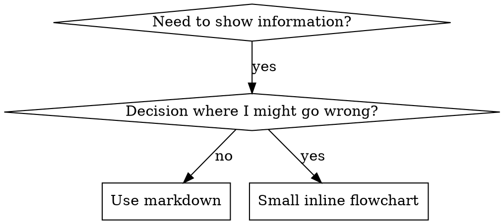

# Writing Skill
> TDD思想应用于流程文档(skill)

## 概览
Ⅰ. skill的效果应围绕收敛Agent的基线行为（无skill指导下的失败行为）展开, 是衡量skill效果的基础指标
> 核心原则：未看到无技能下Agent的失败现象，就无法验证该技能的有效性

Ⅱ. 基线行为通过编写测试用例(测试场景)，观察失败用例来获取

Ⅲ. 理解TDD思想是编写有效skill的基础
> TDD定义了基础的红‑绿‑重构（RED‑GREEN‑REFACTOR）流程

## 红‑绿‑重构循环

实际应用中，Agent的基准行为存在"按下葫芦浮起瓢"的现象，即很难达到基线行为为零的状态。因此完整的技能开发流程应遵循「红‑绿‑重构（RED‑GREEN‑REFACTOR）」循环，尽可能收敛基线行为。


### TDD与skill writing
| TDD概念 | 技能开发环节 | 分类 |
| :--- | :--- | :--- |
| 测试用例 | 具体场景QA对 | 快照 |
| 生产代码 | 技能文档（SKILL.md）| 快照 |
| 测试失败（RED 红） | 未加载技能时，Agent违反规则（基线行为）| 快照 |
| 测试通过（GREEN 绿）| 加载技能后，Agent行为符合约束 | 快照 |
| 重构 | 在保证行为合规的前提下封堵漏洞 | 行为 |
| 先写测试 | 编写技能之前，先执行基线场景 | 行为 |
| 观察失败 | 记录智能体给出的全部辩解/推导逻辑 | 行为 |
| 最小化代码 | 编写技能，针对性解决上述具体违规行为 | 行为 |
| 观察用例通过 | 验证智能体现已符合约束 | 行为 |
| 重构循环 | 发现新的推导借口 → 封堵问题 → 重新验证 | 行为 |

上表展示了TDD思想在技能开发中的应用，简单分类为：行为与快照。快照理解为是红-绿-重构循环中每个行为的产物(初始/中间/最终)。

## 杀鸡焉用牛刀、何时创建skill

### ✅ 需要创建技能的场景
- 该技术方法对你而言并非直观易懂
- 会在多个项目中反复引用该能力
- 模式具备通用性，**非项目专属**
- 可供其他开发者复用受益

### ❌ 不要创建技能的场景
- 一次性、临时解决方案
- 已有完善公开文档的通用标准实践
- 仅适用于特定项目的约定（这类内容放到指令文件中）
- 机械式约束：可通过正则、校验逻辑强制实现的规则，直接做自动化处理；**技能文档留给需要主观判断的业务场景**

---
## 术语注解
1. **one‑off solutions**：一次性方案、临时方案
2. **project‑specific**：项目专属、仅针对单个项目
3. **instructions file**：指令文件，Agent工程存放项目专属提示约束的文件
4. **mechanical constraints**：机械式约束，指可被程序硬规则直接校验的客观规则
5. **regex/validation**：正则表达式 / 程序校验
6. **judgment calls**：主观判断、人工裁量（大模型需要做权衡推理，无法简单用正则校验的场景）

## 对症下药、skill的分类
针对不同问题域用相同的解法，好比拿着榔头拧螺丝。

**技术方法（Technique）**
> 带有明确执行步骤的具体操作方法（例如：基于条件的等待、根因追踪）

**模式（Pattern）**
> 处理问题的思维范式（例如：带标记扁平化处理、测试不变量）

**参考资料（Reference）**
> API文档、语法指南、工具文档（例如办公文档）

## 目录结构
```
skills/
  skill-name/
    SKILL.md              # 主参考文档（必需）
    supporting-file.*     # 按需选用的辅助文件
```

---
## 术语注释
1. **condition‑based‑waiting**：基于条件的等待，工程自动化常用模式，不直译“条件等待”
2. **root‑cause‑tracing**：根因追踪，故障排查标准术语
3. **flatten‑with‑flags**：带标记扁平化，Agent工程专有模式
4. **test‑invariants**：测试不变量，校验系统不变约束的测试思路
5. **Flat namespace**：扁平命名空间，无嵌套层级，便于统一检索
6. **supporting‑file**：辅助附属文件
7. **inline**：内嵌，直接写在主文档SKILL.md中，不拆分成独立文件

## PPT精简版
> ### 三大技能类型
> • Technique技术方法：带步骤的实操方法
> • Pattern模式：问题处理思维范式
> • Reference参考：API、语法、工具文档

## SKILL.md 结构

YAML前置配置必填 name、description 两项，总内容≤1024 字符。技能名称仅支持字母、数字、连字符；描述以第三人称、Use when 句式撰写，只写精准适用场景与特征，不介绍技能功能和流程，优先控制在 500 字符内。

**前置元数据**（YAML 格式）:
- 包含两个必填字段：名称（name）和描述（description）（所有支持字段详见 agentskills.io/specification）
- 元数据总字符数上限：1024 字符
- 名称（name）：仅可使用字母、数字、连字符，禁止使用括号及其他特殊字符
- 描述（description）：采用第三人称表述，仅说明适用场景，不描述功能作用.
  - 固定以 “Use when...”（适用于……场景）开篇，聚焦技能触发条件
  - 需明确写明具体特征、适用场景与使用上下文
  - 严禁概括技能流程与执行步骤（原理详见 SDO 章节）
  - 建议控制在 500 字符以内

**核心术语规范注解**
Frontmatter：前置元数据 / 页头配置（技术文档通用标准术语，特指文件头部 YAML 配置段）
triggering conditions：触发条件（Agent 技能调度核心概念，指技能的启用判定场景）
symptoms：场景特征（非医学释义，指业务/工程中需要启用该技能的问题表现、场景特征）
process/workflow：执行流程、工作链路（区别于适用场景，为技能内部实现逻辑）

```markdown
---
name: Skill-Name-With-Hyphens
description: Use when [specific triggering conditions and symptoms]
---

# Skill Name

## Overview
What is this? Core principle in 1-2 sentences.

## When to Use
[Small inline flowchart IF decision non-obvious]

Bullet list with SYMPTOMS and use cases
When NOT to use

## Core Pattern (for techniques/patterns)
Before/after code comparison

**含义**：技术方法类、思维模式类的技能，统一的核心写作范式是 **提供修改前 / 修改后的代码对比**。

### 作用（配套你前文的 TDD 技能规范）

1. 直观展示**违规基线（before）**：无技能时智能体出错、不规范的代码 / 写法
2. 清晰展示**修复后合规效果（after）**：应用该技能后，正确、规范的代码写法
3. 完美匹配前文「红 - 绿 - 重构」TDD 流程：用前后对比体现**问题→修复**的完整闭环

### 适用范围

仅针对两类技能：

- Technique 技术方法类技能
- Pattern 思维模式类技能

参考资料类技能无需该格式。

## Quick Reference
Table or bullets for scanning common operations

## Implementation
Inline code for simple patterns
Link to file for heavy reference or reusable tools

## Common Mistakes
What goes wrong + fixes

## Real-World Impact (optional)
Concrete results
```
---
# HOW

## Skill Discovery Optimization (SDO)
### 技能检索优化（SDO）
> 对检索至关重要：后续的智能体需要能够**找到**你的技能。

1. **丰富描述字段（Rich Description Field）**

**用途**：智能体读取该描述，来判定针对给定任务应当加载哪些技能。描述要能够回答：**“我现在是否应该读取该技能？”**

**格式**：以 `Use when...` 开头，聚焦触发条件。

**关键要求**：描述 = 使用时机，**不是**技能做什么。

描述应当**只描述触发条件**。不要在描述中概括技能的处理过程或工作流。

**重要原因**：测试表明，如果描述概括了技能工作流，智能体可能直接遵照描述执行，而不去阅读技能完整内容。
例如描述写了“任务之间执行代码审查”，智能体只会做**一次审查**，但技能流程图明确要求两次审查（先规范合规检查，再代码质量检查）。

当把描述改为仅写：`Use when executing implementation plans with independent tasks`（不带工作流概括），智能体就会正确读取流程图，执行两阶段审查流程。

**陷阱**：概括工作流的描述会形成智能体可以利用的捷径，导致智能体跳过技能正文文档。

```markdown
# ❌ 错误：概括工作流 — 智能体可能直接照此执行，不去读技能正文
description: Use when executing plans - dispatches subagent per task with code review between tasks

# ❌ 错误：包含过多流程细节
description: Use for TDD - write test first, watch it fail, write minimal code, refactor

# ✅ 正确：仅写触发条件，不概括工作流
description: Use when executing implementation plans with independent tasks in the current session

# ✅ 正确：只给出触发条件
description: Use when implementing any feature or bugfix, before writing implementation code
```

**内容编写要求**
- 使用具体的触发条件、现象、场景，表明该技能应当启用
- 描述问题本身（竞态条件、行为不一致），不要写特定语言层面现象（setTimeout、sleep）
- 除非技能本身面向特定技术，否则触发条件保持**技术无关**
- 如果是特定技术的技能，要在触发条件中明确体现
- 使用第三人称撰写（该内容会注入系统提示词）
- **严禁概括技能的处理过程或工作流**

```markdown
# ❌ 错误：过于抽象模糊，未说明使用时机
description: For async testing

# ❌ 错误：使用第一人称
description: I can help you with async tests when they're flaky

# ❌ 错误：提及某项技术，但技能并不专属于该技术
description: Use when tests use setTimeout/sleep and are flaky

# ✅ 正确：以 Use when 开头，描述问题，不含工作流
description: Use when tests have race conditions, timing dependencies, or pass/fail inconsistently

# ✅ 正确：面向特定技术的技能，具备明确触发条件
description: Use when using React Router and handling authentication redirects
```

---

## 2. Keyword Coverage
### 2. 关键词覆盖
使用智能体会用来检索的词汇：

- 错误信息：`"Hook timed out"`、`"ENOTEMPTY"`、`"race condition"`
- 现象特征：`"flaky"`、`"hanging"`、`"zombie"`、`"pollution"`
- 同义词：`"timeout/hang/freeze"`、`"cleanup/teardown/afterEach"`
- 工具：真实命令、库名称、文件类型

## 3. Descriptive Naming
### 3. 描述式命名
使用主动语态，动词前置：

✅ `creating‑skills` 而非 `skill‑creation`
✅ `condition‑based‑waiting` 而非 `async‑test‑helpers`

## 4. Token Efficiency (Critical)
### 4. Token 使用效率（关键）
**问题**：入门类与高频引用的技能会加载到**每一次会话**中，每一个 Token 都很宝贵。

目标字数：
- 入门工作流：单篇小于 150 词
- 高频加载技能：整体小于 200 词
- 其他技能：小于 500 词（仍需保持简洁）

**技术手段**

将细节移至工具帮助信息：
```markdown
# ❌ 错误：在 SKILL.md 中罗列全部参数
search-conversations supports --text, --both, --after DATE, --before DATE, --limit N

# ✅ 正确：引用 --help 帮助
search-conversations supports multiple modes and filters. Run --help for details.
```

使用交叉引用：
```markdown
# ❌ 错误：重复书写工作流细节
When searching, dispatch subagent with template...
[20 lines of repeated instructions]

# ✅ 正确：引用其他技能
Always use subagents (50‑100x context savings). REQUIRED: Use [other‑skill‑name] for workflow.
```

压缩示例：
```markdown
# ❌ 错误：冗长示例（42 词）
your human partner: "How did we handle authentication errors in React Router before?"
You: I'll search past conversations for React Router authentication patterns.
[Dispatch subagent with search query: "React Router authentication error handling 401"]

# ✅ 正确：极简示例（20 词）
Partner: "How did we handle auth errors in React Router?"
You: Searching...
[Dispatch subagent → synthesis]
```

消除冗余：
- 不要重复已在被引用技能里的内容
- 不要解释命令本身显而易见的含义
- 同一模式不要提供多份示例

校验方式：
```bash
wc -w skills/path/SKILL.md
# getting‑started workflows: aim for <150 each
# Other frequently‑loaded: aim for <200 total
```

命名依据：**执行的动作**或**核心思路**：
✅ `condition‑based‑waiting` 优于 `async‑test‑helpers`
✅ `using‑skills` 优于 `skill‑usage`
✅ `flatten‑with‑flags` 优于 `data‑structure‑refactoring`
✅ `root‑cause‑tracing` 优于 `debugging‑techniques`

动名词（‑ing）很适合描述流程类技能：
`creating‑skills`、`testing‑skills`、`debugging‑with‑logs`
采用主动语态，描述你要执行的动作。

## 5. Cross‑Referencing Other Skills
### 5. 引用其他技能
文档中需要引用其他技能时：

只使用技能名称，搭配明确的强制标记：

✅ 正确：**REQUIRED SUB‑SKILL:** Use superpowers:test‑driven‑development
✅ 正确：**REQUIRED BACKGROUND:** You MUST understand superpowers:systematic‑debugging

❌ 错误：See skills/testing/test‑driven‑development（无法判断是否为强制依赖）
❌ 错误：@skills/testing/test‑driven‑development/SKILL.md（强制加载，消耗上下文）

> 为什么不要使用 @ 链接：`@` 语法会立刻强制加载文件，在实际需要之前就消耗二十万以上的上下文容量。

---

## Flowchart Usage
### 流程图使用规范


**仅在以下场景使用流程图**：
- 不直观的决策分支
- 存在提前终止风险的流程循环
- “选择A还是B”类的判断逻辑

**禁止在以下场景使用流程图**：
- 参考资料 → 使用表格、列表
- 代码示例 → 使用 Markdown 代码块
- 顺序化指令 → 使用编号列表
- 无实际语义的标签（step1、helper2）

参考本目录下的 `graphviz‑conventions.dot`，查看 Graphviz 样式规范。

面向人类协作方可视化：使用本目录下的 `render‑graphs.js`，将技能内流程图渲染为 SVG：
```bash
./render-graphs.js ../some-skill           # 每张图表单独输出
./render-graphs.js ../some-skill --combine # 全部图表合并为单个SVG
```

## Code Examples
### 代码示例
一个高质量示例远胜于多个平庸示例。

选择最贴合场景的语言：
- 测试技术 → TypeScript/JavaScript
- 系统调试 → Shell/Python
- 数据处理 → Python

✅ 合格示例特征：
- 完整、可直接运行
- 注释清晰，说明**为什么这么做**
- 来源于真实业务场景
- 模式表达清晰
- 便于二次修改复用（非泛化模板）

❌ 应当避免：
- 提供5种及以上语言的实现
- 制作填空式模板
- 编造脱离实际的示例

> 你具备代码移植能力，一份优质示例就足够。

## File Organization
### 文件组织

**自包含型技能**
```
defense-in-depth/
  SKILL.md    # 全部内容内嵌于此
```
适用条件：全部内容体量可控，无需大篇幅参考资料。

**附带可复用工具的技能**
```
condition-based-waiting/
  SKILL.md    # 概述 + 核心模式
  example.ts  # 可复用辅助代码
```
适用条件：存在可复用代码，而非单纯文本描述。

**携带大篇幅参考文档的技能**
```
pptx/
  SKILL.md       # 概述 + 工作流程
  pptxgenjs.md   # 600行API参考文档
  ooxml.md       # 500行XML结构文档
  scripts/       # 可执行工具脚本
```
适用条件：参考资料体量过大，不适合内嵌在主文档。

---
## The Iron Law (Same as TDD)

### 铁律（与 TDD 保持一致）

**绝不先编写技能，再补失败测试用例**

该规则同时适用于**全新技能开发**以及**对已有技能的修改编辑**。

先写技能再做测试？直接删除，从头再来。修改技能但不做测试？同样属于违规。

无任何例外：

- “简单新增内容” 不能例外
- “仅新增一个章节” 不能例外
- “仅文档更新” 不能例外
- 不要把未经过测试的变更留存作为 “参考资料”
- 不要在测试运行过程中一边跑一边调整改写技能
- 删除就意味着彻底删除

**REQUIRED BACKGROUND:** The superpowers:test‑driven‑development skill explains why this matters. Same principles apply to documentation.

> 
> **必备前置知识**：`superpowers:test‑driven‑development` 技能阐述了该规则背后的原因，这套原则同样适用于文档编写。

---
## Testing All Skill Types
### 各类技能的测试方案
不同类型的技能需要采用不同的测试手段：

#### Discipline‑Enforcing Skills (rules/requirements)
#### 约束强制型技能（规则/强制要求）
示例：TDD、verification‑before‑completion、designing‑before‑coding

测试手段：
- 理论设问：智能体是否理解对应规则
- 压力场景：高压环境下是否依然遵守规则
- 多压力叠加：时间压力 + 沉没成本 + 疲劳场景
- 识别智能体的辩解逻辑，并补充明确的对抗约束

成功标准：**智能体在最大压力下仍然遵守规则**

#### Technique Skills (how‑to guides)
#### 技术方法类技能（操作指南）
示例：condition‑based‑waiting、root‑cause‑tracing、defensive‑programming

测试手段：
- 落地应用场景：能否正确使用该技术方法
- 变体场景：能否处理各类边界情况
- 信息缺失测试：指令是否存在漏洞

成功标准：**智能体可以在全新场景下正确运用该技术**

#### Pattern Skills (mental models)
#### 模式类技能（思维模型）
示例：reducing‑complexity、information‑hiding concepts

测试手段：
- 场景识别场景：能否识别该模式的适用时机
- 落地应用场景：能否使用这套思维模型
- 反例测试：清楚什么场景**不应该**使用该模式

成功标准：**智能体能够正确判断模式的适用时机与使用方式**

#### Reference Skills (documentation/APIs)
#### 参考资料类技能（文档/API）
示例：API文档、命令参考、库使用指南

测试手段：
- 信息检索场景：能否定位到正确信息
- 应用场景：能否正确使用查到的内容
- 缺口测试：是否覆盖常见使用场景

成功标准：**智能体可以检索到参考信息并正确使用**

---
## Common Rationalizations for Skipping Testing

### 跳过测试的常见借口

| 借口 | 现实情况 |
| --- | --- |
| “Skill is obviously clear”   “这个技能逻辑显而易见” | 对你清晰 ≠ 对其他智能体清晰。必须做测试。 |
| “It's just a reference”   “这只是一份参考资料” | 参考文档同样会存在内容缺口、表述模糊的段落。需要测试信息检索能力。 |
| “Testing is overkill”   “测试属于过度操作” | 未测试的技能一定会存在问题。15分钟测试可以挽回数小时排错成本。 |
| “I'll test if problems emerge”   “等出现问题我再测试” | 出现问题就代表智能体已经无法正常使用该技能。**部署前完成测试**。 |
| “Too tedious to test”   “测试过程太繁琐” | 测试的繁琐程度远低于线上调试失效技能。 |
| “I'm confident it's good”   “我确信它没有问题” | 过度自信必然带来隐患。无论如何都要测试。 |
| “Academic review is enough”   “书面审阅就足够了” | 读懂 ≠ 会使用。必须测试实际应用场景。 |
| “No time to test”   “没有时间做测试” | 部署未测试的技能，后续修复会耗费更多时间。 |

> 
> 以上全部情况的统一结论：部署前必须测试，无例外。

## Match the Form to the Failure

### 根据失效类型匹配文档形式

在编写指导规则之前，先对基线失效现象分类。针对某一类失效有效的文档形式，对另一类失效反而会产生明显负面效果。

| 基线失效现象 | 正确文档形式 | 错误文档形式 |
| --- | --- | --- |
| 在压力下跳过/违反规则（明知规则却仍然违规） | 禁止性条款 + 辩解逻辑对照表 + 风险标记（参见下文“加固防护”） | 软性引导（“建议……”、“可考虑……”） |
| 行为合规，但输出格式错误（提示词臃肿、关键结论被掩盖、重复复述规范） | 正向范式/契约：明确输出**应该是什么**，定义输出组成部分与顺序 | 禁止清单（“不要复述”、“禁止叙述过程”） |
| 在已有输出中缺失某一项必填内容 | 结构化约束：模板中设置 **REQUIRED** 字段/占位槽位 | 在模板附近用文字提醒 |
| 行为需要依据条件分支变化 | 绑定可观测判定条件的条件语句（“如果存在需求文档，则引用它”） | 无条件规则外加豁免子句 |

> 
> 为什么禁止类描述在格式类问题上会起反效果：
> 在存在冲突目标（例如“保证提示词自完备”）时，智能体会对“不要做X”这类禁令做变通处理。在针对调度提示词的对照措辞测试中，使用禁止式写法的实验组，产生的无效内容显著多于使用正向范式的实验组，表现甚至差于无任何指导的对照组。应当针对你的场景做小规模验证，不要默认优先选用禁止式写法。
> 正向范式没有留给智能体变通空间：输出要么完全匹配规定格式，要么不匹配。

无论选用哪种文档形式，遵守以下规则：

1. **不要增加模糊变通子句**。类似“不要做X，除非特殊情况”会重新打开变通空间。对照测试表明，在效果良好的正向范式上追加一条模糊子句，会让输出从稳定变为混乱。真实的例外场景，应当写成独立的、基于可观测条件的分支逻辑。
2. **豁免子句作用域不可控**。例如“该限制不适用于代码块”，依然会对代码块产生压制效果。如果部分输出需要豁免，需要重构整体结构，让规则本身无法作用到该部分。

## Bulletproofing Skills Against Rationalization
### 抵御辩解逻辑，加固技能防护
约束强制类技能（例如TDD）需要能够抵抗智能体的各类辩解。智能体具备推理能力，在压力场景下会寻找规则漏洞。

**适用范围**：这套工具集用于处理**规则违背类失效**——智能体明明知晓规则，但在压力下选择跳过规则。
对于输出格式错误、内容缺失类问题，基于禁令的加固手段会起到反效果；请改用上文「根据失效类型匹配文档形式」中对应的方案。

心理学提示：理解说服技术背后的原理，有助于系统化地运用这套机制。参考 `persuasion‑principles.md`，其中包含权威、承诺、稀缺性、社会认同、一致性原则相关研究依据（Cialdini, 2021；Meincke et al., 2025）。

### Close Every Loophole Explicitly
### 显式封堵每一处漏洞
不要只陈述规则本身，同时要明确禁止各类规避手段。

```markdown Write code before test? Delete it. ``` ```markdown Write code before test? Delete it. Start over.
No exceptions:

Don't keep it as "reference"
Don't "adapt" it while writing tests
Don't look at it
Delete means delete
</Good>

### Address "Spirit vs Letter" Arguments

Add foundational principle early:

```markdown
**Violating the letter of the rules is violating the spirit of the rules.**

This cuts off entire class of "I'm following the spirit" rationalizations.

## Build Rationalization Table

### 构建辩解逻辑对照表

收集基线测试过程中出现的各类辩解理由（详见下文测试章节）。智能体产生的每一条借口都录入表格：

| Excuse 借口 | Reality 客观事实 |
| --- | --- |
| "Too simple to test"   “逻辑太简单，无需测试” | Simple code breaks. Test takes 30 seconds.   简单代码同样会出错，测试仅需30秒。 |
| "I'll test after"   “我之后再做测试” | Tests passing immediately prove nothing.   后期跑通测试无法证明任何前置约束。 |
| "Tests after achieve same goals"   “后补测试也可以达到同样目的” | Tests‑after = "what does this do?" Tests‑first = "what should this do?"   后补测试回答：“这段代码实际做了什么”；先写测试回答：“它应当做到什么”。 |

## Create Red Flags List

### 创建风险警示清单

便于智能体出现辩解倾向时做自我检查：

## Red Flags - STOP and Start Over

## 风险警示 — 立刻停止，从头开始

- Code before test
先写业务代码，后写测试
- "I already manually tested it"
“我已经手工测试过了”
- "Tests after achieve the same purpose"
“后补测试可以达到相同效果”
- "It's about spirit not ritual"
“重在领会精神，不必拘泥流程”
- "This is different because..."
“本次情况特殊，因为……”

> 
> **All of these mean: Delete code. Start over with TDD.**
> 出现以上任意一条：删除代码，以TDD模式重新开始。

## Update SDO for Violation Symptoms

### 针对违规征兆更新SDO（技能检索优化）

在描述字段中补充：**即将发生违规行为时的场景征兆**。

```
description: use when implementing any feature or bugfix, before writing implementation code
```

> 
> 描述：适用于开发功能或修复缺陷，在编写实现代码之前使用。

## RED‑GREEN‑REFACTOR for Skills
### 技能的红‑绿‑重构流程
遵循TDD循环：

**RED：编写失败测试（基线）**
在**不加载该技能**的前提下，使用子代理运行压力场景。完整记录实际行为：
- 智能体做出了哪些选择？
- 使用了哪些辩解理由（原样记录原文）？
- 哪些压力条件触发了违规行为？

这就是“观察测试失败”阶段：**编写技能之前，必须先看到智能体的原生行为**。

**GREEN：编写最小化技能**
编写技能，针对性解决上述已发现的辩解逻辑。不要为假想场景额外增加内容。

使用同一套场景，**加载技能后重新运行**。此时智能体应当遵守规则。

**REFACTOR：封堵漏洞**
如果智能体出现新的辩解逻辑：补充明确的对抗约束，重新测试，直到做到完整防护。

### Micro‑Test Wording Before Full Scenarios
### 完整场景前先做微测试
完整压力场景是最终校验环节，但每一轮迭代成本高、速度慢。先通过微测试验证措辞本身：
- 每次调用使用全新上下文；可以直接调用原始API，若没有API权限则使用单次调用子代理。
- 系统提示词使用真实运行环境（完整技能/提示模板，不要单独截取一小段指导文本）；用户消息传入会诱发失效行为的任务。
- **必须设置无指导对照组**。如果对照组都不会出现目标失效，则说明没有问题需要修复，停止，不要编写指导规则。
- 每种变体至少跑5次；单条样本会产生误导。
- 人工审阅每一条命中标记。可以做程序化打分，但模板回显、引用反例都会被误判为命中；只依靠自动化统计会高估失败与成功率。
- 结果离散度本身就是指标。措辞有效时，多次执行会收敛到同一输出形态。5次执行出现5种不同解读，代表文本约束力不足；优先优化表达形式，而不是堆砌更多文字。

> 微测试用于校验措辞，**不能替代约束类技能的完整压力场景测试**。

完整测试方法论参考：`testing‑skills‑with‑subagents.md`
- 如何编写压力场景
- 压力类型（时间、沉没成本、权威、疲劳）
- 系统性补全漏洞
- 元测试技术

### Anti‑Patterns
### 反模式
❌ 叙事式示例
> "In session 2025‑10‑03, we found empty projectDir caused…"
问题：过于具体，无法复用。

❌ 多语言稀释
> example‑js.js、example‑py.py、example‑go.go
问题：每个示例质量平庸，维护成本高。

❌ 在流程图中写代码
```dot
step1 [label="import fs"];
step2 [label="read file"];
```
问题：无法复制粘贴，可读性差。

❌ 无实际语义的标签
> helper1、helper2、step3、pattern4
问题：标签应当具备实际语义。

### STOP: Before Moving to Next Skill
### 停止点：切换到下一个技能之前
写完任意一项技能后，**必须停下来，走完完整部署流程**。

禁止行为：
- 批量创建多个技能，却不对每个技能单独测试
- 当前技能未验证完成，就开始下一个技能
- 以“批量处理效率更高”为由跳过测试

> 下面的部署核对清单对**每一个技能**都是强制要求。
> 部署未测试的技能等同于部署未测试代码，属于违反质量标准。

### Skill Creation Checklist (TDD Adapted)
### 技能创建核对清单（适配TDD）
> 重要：下面每一项都要建立待办项逐一完成。

#### RED Phase‑Write Failing Test：红阶段‑编写失败测试
- [ ] 构造压力场景（约束强制类技能需要3种及以上压力叠加）
- [ ] 不加载技能运行场景，原样记录基线行为
- [ ] 提炼辩解逻辑与失效模式

#### GREEN Phase‑Write Minimal Skill：绿阶段‑编写最小化技能
- [ ] 命名仅使用字母、数字、连字符（禁止括号、特殊字符）
- [ ] YAML前置元数据，必填name、description（总长度≤1024字符，参见规范）
- [ ] description以`Use when…`开头，包含具体触发条件、现象
- [ ] description使用第三人称
- [ ] 全文植入检索关键词（报错信息、现象、工具名称）
- [ ] 清晰概述，阐明核心原则
- [ ] 针对性解决红阶段发现的基线失效
- [ ] 指导形式与失效类型匹配（参见根据失效类型匹配文档形式）
- [ ] 输出约束类指导：做措辞微测试，设置无指导对照组（≥5轮，人工审阅全部命中样本）；纯参考类技能此项不适用
- [ ] 代码直接内嵌，或链接到独立文件
- [ ] 一份高质量示例，不做多语言版本
- [ ] 加载技能运行场景，验证智能体行为合规

#### REFACTOR Phase‑Close Loopholes：重构阶段‑封堵漏洞
- [ ] 从测试中识别出新的辩解逻辑
- [ ]（约束类技能）补充对应的对抗约束
- [ ] 根据全部测试迭代，构建辩解逻辑对照表
- [ ] 建立风险警示清单
- [ ] 反复测试，做到完整防护

#### Quality Checks：质量检查
- [ ] 仅在决策逻辑不直观时，使用小型流程图
- [ ] 提供快速参考表格
- [ ] 常见错误章节
- [ ] 不含叙事故事类内容
- [ ] 附属文件仅用于可复用工具或大篇幅参考资料

#### Deployment：部署
- [ ] Git提交并推送至个人Fork（如已配置）
- [ ] 如果具备通用价值，考虑提交PR回馈主仓库

### Discovery Workflow
### 检索发现流程
后续智能体查找技能的完整链路：
1. 遇到问题（例如“测试不稳定”）
2. 检索技能（检索描述字段、浏览分类）
3. 匹配到SKILL.md（描述命中条件）
4. 浏览概述：判断是否相关
5. 阅读模式（快速参考表格）
6. （真正执行时）加载示例

> 针对该链路做优化：把可检索关键词放在靠前位置，多次出现。