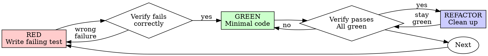

# Test-Driven Development (TDD)

# 测试驱动开发 (TDD)

## Overview

## 概述

Write the test first. Watch it fail. Write minimal code to pass.

先写测试。看它失败。写最少的代码让它通过。

**Core principle:** If you didn't watch the test fail, you don't know if it tests the right thing.

**核心原则：** 如果你没有看到测试失败，你就不知道它是否测试了正确的东西。

**Violating the letter of the rules is violating the spirit of the rules.**

**违反规则的字面意义就是违反规则的精神。**

## When to Use

## 何时使用

**Always:**
- New features
- Bug fixes
- Refactoring
- Behavior changes

**始终：**
- 新功能
- Bug修复
- 重构
- 行为变更

**Exceptions (ask your human partner):**
- Throwaway prototypes
- Generated code
- Configuration files

**例外（询问你的人类搭档）：**
- 一次性原型
- 生成的代码
- 配置文件

Thinking "skip TDD just this once"? Stop. That's rationalization.

在想"就这次跳过TDD"？停下来。那是在找借口。

## The Iron Law

## 铁律

```
NO PRODUCTION CODE WITHOUT A FAILING TEST FIRST
```

```
没有失败的测试，就没有生产代码
```

Write code before the test? Delete it. Start over.

先写代码再写测试？删掉它。从头开始。

**No exceptions:**
- Don't keep it as "reference"
- Don't "adapt" it while writing tests
- Don't look at it
- Delete means delete

**没有例外：**
- 不要把它留作"参考"
- 不要在写测试时"改编"它
- 不要看它
- 删除就是删除

Implement fresh from tests. Period.

从测试出发全新实现。到此为止。

## Red-Green-Refactor

## 红-绿-重构



### RED - Write Failing Test

### 红 - 编写失败测试

Write one minimal test showing what should happen.

编写一个最小测试，展示应该发生什么。

<Good>
```typescript
test('retries failed operations 3 times', async () => {
  let attempts = 0;
  const operation = () => {
    attempts++;
    if (attempts < 3) throw new Error('fail');
    return 'success';
  };

  const result = await retryOperation(operation);

  expect(result).toBe('success');
  expect(attempts).toBe(3);
});
```
Clear name, tests real behavior, one thing
清晰的命名，测试真实行为，一件事
</Good>

<Bad>
```typescript
test('retry works', async () => {
  const mock = jest.fn()
    .mockRejectedValueOnce(new Error())
    .mockRejectedValueOnce(new Error())
    .mockResolvedValueOnce('success');
  await retryOperation(mock);
  expect(mock).toHaveBeenCalledTimes(3);
});
```
Vague name, tests mock not code
模糊的命名，测试模拟而非代码
</Bad>

**Requirements:**
- One behavior
- Clear name
- Real code (no mocks unless unavoidable)

**要求：**
- 一个行为
- 清晰的命名
- 真实代码（除非不可避免，否则不用模拟）

### Verify RED - Watch It Fail

### 验证红 - 看它失败

**MANDATORY. Never skip.**

**强制要求。绝不跳过。**

```bash
npm test path/to/test.test.ts
```

Confirm:
- Test fails (not errors)
- Failure message is expected
- Fails because feature missing (not typos)

确认：
- 测试失败（不是报错）
- 失败消息符合预期
- 因为功能缺失而失败（不是拼写错误）

**Test passes?** You're testing existing behavior. Fix test.

**测试通过了？** 你在测试已有行为。修改测试。

**Test errors?** Fix error, re-run until it fails correctly.

**测试报错了？** 修复错误，重新运行直到它正确地失败。

### GREEN - Minimal Code

### 绿 - 最少代码

Write simplest code to pass the test.

编写最简单的代码让测试通过。

<Good>
```typescript
async function retryOperation<T>(fn: () => Promise<T>): Promise<T> {
  for (let i = 0; i < 3; i++) {
    try {
      return await fn();
    } catch (e) {
      if (i === 2) throw e;
    }
  }
  throw new Error('unreachable');
}
```
Just enough to pass
刚好足够通过
</Good>

<Bad>
```typescript
async function retryOperation<T>(
  fn: () => Promise<T>,
  options?: {
    maxRetries?: number;
    backoff?: 'linear' | 'exponential';
    onRetry?: (attempt: number) => void;
  }
): Promise<T> {
  // YAGNI
}
```
Over-engineered
过度工程
</Bad>

Don't add features, refactor other code, or "improve" beyond the test.

不要添加功能、重构其他代码，或"改进"超出测试范围的内容。

### Verify GREEN - Watch It Pass

### 验证绿 - 看它通过

**MANDATORY.**

**强制要求。**

```bash
npm test path/to/test.test.ts
```

Confirm:
- Test passes
- Other tests still pass
- Output pristine (no errors, warnings)

确认：
- 测试通过
- 其他测试仍然通过
- 输出干净（无错误、警告）

**Test fails?** Fix code, not test.

**测试失败了？** 修复代码，而非测试。

**Other tests fail?** Fix now.

**其他测试失败了？** 立刻修复。

### REFACTOR - Clean Up

### 重构 - 清理

After green only:
- Remove duplication
- Improve names
- Extract helpers

仅在绿之后：
- 消除重复
- 改善命名
- 提取辅助函数

Keep tests green. Don't add behavior.

保持测试为绿。不要添加行为。

### Repeat

### 重复

Next failing test for next feature.

下一个功能的下一个失败测试。

## Good Tests

## 好的测试

| Quality | Good | Bad |
|---------|------|-----|
| **Minimal** | One thing. "and" in name? Split it. | `test('validates email and domain and whitespace')` |
| **Clear** | Name describes behavior | `test('test1')` |
| **Shows intent** | Demonstrates desired API | Obscures what code should do |

| 质量 | 好 | 坏 |
|------|-----|-----|
| **最小化** | 一件事。名字里有"and"？拆分它。 | `test('validates email and domain and whitespace')` |
| **清晰** | 命名描述行为 | `test('test1')` |
| **展示意图** | 演示期望的API | 掩盖代码应该做什么 |

When writing or changing any test, read [writing-good-tests.md](writing-good-tests.md) for the rules that keep tests honest:
- Name the production change that would make the test fail — before writing it
- Assert on real behavior, never on mock behavior
- Keep test-only code in test utilities, out of production classes
- Understand a dependency's side effects before mocking it

在编写或修改任何测试时，阅读 [writing-good-tests.md](writing-good-tests.md) 了解保持测试诚实的规则：
- 在编写测试之前，命名会让该测试失败的生产代码变更
- 断言真实行为，永远不要断言模拟行为
- 将仅测试使用的代码保留在测试工具中，远离生产类
- 在模拟依赖项之前，了解其副作用

## Common Rationalizations

## 常见借口

| Excuse | Reality |
|--------|---------|
| "Too simple to test" | Simple code breaks. Test takes 30 seconds. |
| "I'll test after" | Tests written after pass immediately — which proves nothing. They may test the wrong thing, test the implementation instead of the behavior, or miss the edge case you forgot. You never watched it fail, so you never proved it can catch the bug. Test-first forces that failure. |
| "Tests after achieve same goals (spirit not ritual)" | Tests-after answer "what does this do?"; tests-first answer "what should this do?" Tests written after are biased by the code you already wrote — you verify the cases you remembered, not the ones you'd have discovered. Coverage without proof the tests work. |
| "Already manually tested" | Manual testing is ad-hoc: no record of what you covered, no way to re-run it when the code changes, easy to forget cases under pressure. "Worked when I tried it" ≠ comprehensive. Automated tests run the same way every time. |
| "Deleting X hours is wasteful" | Sunk cost fallacy — that time is already spent either way. The real choice: rewrite with TDD (high confidence) vs. keep it and bolt tests on after (low confidence, likely bugs). Keeping code you can't trust is the waste. |
| "Keep as reference, write tests first" | You'll adapt it. That's testing after. Delete means delete. |
| "Need to explore first" | Fine. Throw away exploration, start with TDD. |
| "Test hard = design unclear" | Listen to test. Hard to test = hard to use. |
| "TDD will slow me down" | TDD IS the pragmatic path: catches bugs before commit, prevents regressions, lets you refactor without fear. "Pragmatic" shortcuts mean debugging in production — slower, not faster. |
| "Manual test faster" | Manual doesn't prove edge cases. You'll re-test every change. |
| "Existing code has no tests" | You're improving it. Add tests for existing code. |

| 借口 | 现实 |
|------|------|
| "太简单了不需要测试" | 简单代码也会出bug。测试只需30秒。 |
| "我之后再测试" | 之后写的测试会立刻通过——这证明不了任何事。它们可能测试了错误的东西，测试了实现而非行为，或遗漏了你忘记的边界情况。你从未看到它失败，所以你从未证明它能捕获bug。测试优先强制了那种失败。 |
| "事后测试同样能达到目的（注重精神而非仪式）" | 事后测试回答"它做了什么？"；先写测试回答"它应该做什么？"事后写的测试受你已有代码的偏见影响——你验证的是你记得的用例，而非你会发现的用例。有覆盖率却无法证明测试有效。 |
| "已经手动测试过了" | 手动测试是临时的：没有你覆盖了什么的记录，代码变更时无法重新运行，压力下容易遗忘用例。"我试过能用" ≠ 全面。自动化测试每次以相同方式运行。 |
| "删掉X小时的工作是浪费" | 沉没成本谬误——那段时间无论怎样都已花费。真正的选择：用TDD重写（高置信度）vs. 保留它并事后补测试（低置信度，可能有bug）。保留你无法信任的代码才是浪费。 |
| "留作参考，先写测试" | 你会改编它。那就是事后测试。删除就是删除。 |
| "需要先探索" | 可以。扔掉探索成果，用TDD开始。 |
| "测试很难 = 设计不清晰" | 听测试的。难测试 = 难使用。 |
| "TDD会拖慢我" | TDD就是务实的路径：在提交前捕获bug、防止回归、让你无畏重构。"务实"的捷径意味着在生产环境调试——更慢，而非更快。 |
| "手动测试更快" | 手动无法证明边界情况。每次变更你都要重新测试。 |
| "现有代码没有测试" | 你在改进它。为现有代码添加测试。 |

## Red Flags - STOP and Start Over

## 红旗 - 停下来，从头开始

- Code before test
- 先写代码再写测试

- Test after implementation
- 实现之后才写测试

- Test passes immediately
- 测试立刻通过

- Can't explain why test failed
- 无法解释测试为什么失败

- Tests added "later"
- 测试"以后"才加

- Rationalizing "just this once"
- 找借口"就这次"

- "I already manually tested it"
- "我已经手动测试过了"

- "Tests after achieve the same purpose"
- "事后测试同样能达到目的"

- "It's about spirit not ritual"
- "注重精神而非仪式"

- "Keep as reference" or "adapt existing code"
- "留作参考"或"改编现有代码"

- "Already spent X hours, deleting is wasteful"
- "已经花了X小时，删掉是浪费"

- "TDD is dogmatic, I'm being pragmatic"
- "TDD是教条主义，我是务实的"

- "This is different because..."
- "这不一样，因为……"

**All of these mean: Delete code. Start over with TDD.**

**所有这些都意味着：删除代码。用TDD从头开始。**

## Example: Bug Fix

## 示例：Bug修复

**Bug:** Empty email accepted

**Bug：** 空邮箱被接受

**RED**
```typescript
test('rejects empty email', async () => {
  const result = await submitForm({ email: '' });
  expect(result.error).toBe('Email required');
});
```

**红**
```typescript
test('rejects empty email', async () => {
  const result = await submitForm({ email: '' });
  expect(result.error).toBe('Email required');
});
```

**Verify RED**
```bash
$ npm test
FAIL: expected 'Email required', got undefined
```

**验证红**
```bash
$ npm test
FAIL: expected 'Email required', got undefined
```

**GREEN**
```typescript
function submitForm(data: FormData) {
  if (!data.email?.trim()) {
    return { error: 'Email required' };
  }
  // ...
}
```

**绿**
```typescript
function submitForm(data: FormData) {
  if (!data.email?.trim()) {
    return { error: 'Email required' };
  }
  // ...
}
```

**Verify GREEN**
```bash
$ npm test
PASS
```

**验证绿**
```bash
$ npm test
PASS
```

**REFACTOR**
Extract validation for multiple fields if needed.

**重构**
如需要，为多个字段提取验证逻辑。

## Verification Checklist

## 验证清单

Before marking work complete:

在标记工作完成之前：

- [ ] Every new function/method has a test
- [ ] 每个新函数/方法都有测试

- [ ] Watched each test fail before implementing
- [ ] 在实现之前看到每个测试失败

- [ ] Each test failed for expected reason (feature missing, not typo)
- [ ] 每个测试因为预期原因失败（功能缺失，非拼写错误）

- [ ] Wrote minimal code to pass each test
- [ ] 编写了最少的代码让每个测试通过

- [ ] All tests pass
- [ ] 所有测试通过

- [ ] Output pristine (no errors, warnings)
- [ ] 输出干净（无错误、警告）

- [ ] Tests use real code (mocks only if unavoidable)
- [ ] 测试使用真实代码（仅在不可避免时使用模拟）

- [ ] Edge cases and errors covered
- [ ] 覆盖边界情况和错误

Can't check all boxes? You skipped TDD. Start over.

无法勾选所有项？你跳过了TDD。从头开始。

## When Stuck

## 遇到困难时

| Problem | Solution |
|---------|----------|
| Don't know how to test | Write wished-for API. Write assertion first. Ask your human partner. |
| Test too complicated | Design too complicated. Simplify interface. |
| Must mock everything | Code too coupled. Use dependency injection. |
| Test setup huge | Extract helpers. Still complex? Simplify design. |

| 问题 | 解决方案 |
|------|----------|
| 不知道如何测试 | 编写期望的API。先写断言。询问你的人类搭档。 |
| 测试太复杂 | 设计太复杂。简化接口。 |
| 必须模拟一切 | 代码耦合过重。使用依赖注入。 |
| 测试设置庞大 | 提取辅助函数。仍然复杂？简化设计。 |

## Debugging Integration

## 调试集成

Bug found? Write failing test reproducing it. Follow TDD cycle. Test proves fix and prevents regression.

发现bug？编写重现它的失败测试。遵循TDD循环。测试证明修复并防止回归。

Never fix bugs without a test.

绝不不带测试地修复bug。

## Final Rule

## 最终规则

```
Production code → test exists and failed first
Otherwise → not TDD
```

```
生产代码 → 测试存在且曾先失败
否则 → 不是TDD
```

No exceptions without your human partner's permission.

没有你的人类搭档的许可，没有例外。
