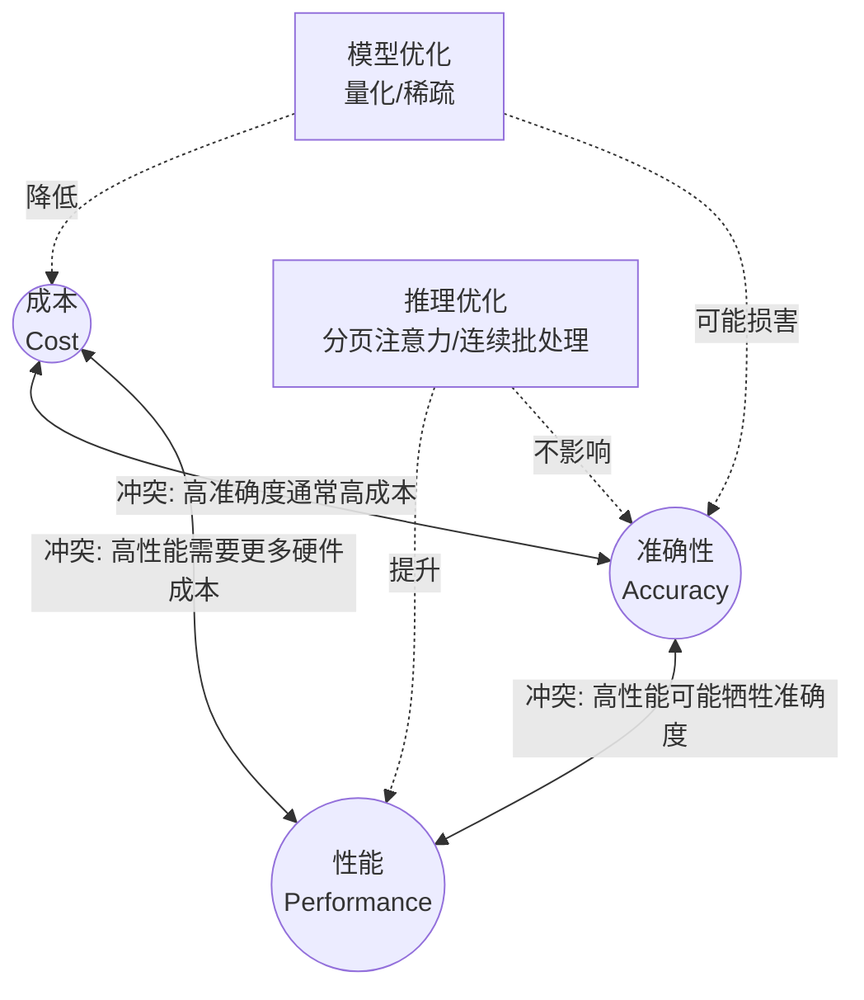

# Why Efficient LLM Deployment Matters
在2023年初，基本上还没有具有竞争力的开源模型。而现在Hugging Face上有成千上万的模型，挑战已经从"能获取一个好的模型" 转变为 "能高效运行模型"。
为什么不调用Inference API 而需要自己部署模型，有以下四个原因:
1. Cost Saving
2. Security
3. Control
4. Customization
关键技术指标包括针对业务场景的准确度（Accuracy）以及影响用户体验与成本的推理性能（TTFT, ITL, TPS）。

---
## measurable targets
系统能否处理生成级别的规模，LLM必须同时足够快和足够精准。
LLM部署需要可衡量的服务级别指标(SLI)目标，并以此制定服务级别目标(service level objectives SLO)来衡量这一点。有两个维度需要跟踪，分别是准确度和性能推理

### Accuracy 
准确度的SLO是必须达到业务场景的可用阈值，这取决于用例。而模型卡片提供的基准测试数据正是设定这一阈值的重要参考。
其中，准确度包括正确率、幻觉率（Hallucination Rate）、对齐度（Alignment/Safety）。
而模型卡片为某业务场景提供决策参考，例如：某个模型在法律问答上的准确率是85%”，业务如果要求90%，就知道不能直接用，需要微调（Fine-tuning）或通过RAG增强。

### Inference Performance
推理性能重点从**延迟指标**和**吞吐量**来制定SLO。其中，有三个重要的延迟指标：
-  TTFT(Time to first token)：这是生成输出第一个词元所需的时间，它反映了用户在看到任何响应之前需要等待的时间
-  ITL(Inter-token Latency 词元间延迟): 不包括第一个词元，是生成输出中连续词元之间的平均时间。这有助于评估推理的流畅性和速度
-  Request latency：请求延迟，反映端到端的时间
吞吐量（Throughput）是所有请求平均每秒生成的输出词元数量

---
## What Requirements For Running An LLM
运行大模型是内存受限任务。以Llama 3 70B 为例，量化权重与KV缓存的显存占用，介绍硬件选型。

### Hardware
- GPU memory
GPU内存必须容纳两样东西，模型权重和KV缓存。以Llama 3 700B版本为例，考虑一下运行LLM的**硬件要求**

首先计算权重，对于70B参数的模型，其权重所占用的内存大小取决于所使用的数值精度（数据类型）。
基本的计算公式为：权重大小 = 参数量 ${\times}$ 单个参数的字节数。不同精度下的具体计算结果如下：
| 数据类型（精度） | 每个参数占用字节数 | 70B权重计算过程 | 理论显存/存储占用 |  生产环境部署建议 |
| :---- | :---- | :---- | :---- | :---- |
| FP32 (单精度浮点) | 4 字节 (Bytes) | $\frac{70 \times 10^9 \times 4}{10^9}$ | ~280 GB | 极少用于推理，多用于全量微调。 |
| FP16/BF16 (半精度) | 2 字节 (Bytes) | $\frac{70 \times 10^9 \times 2}{10^9}$ | ~140 GB | 开源模型默认精度，需2张80GB显卡 |
| INT8 (8位量化) | 1 字节 (Bytes) | $\frac{70 \times 10^9 \times 1}{10^9}$ | ~70 GB | 兼顾速度与精度的折中方案。 |
| INT4 (4位量化) | 4 字节 (Bytes) | $\frac{70 \times 10^9 \times 0.5}{10^9}$ | ~35 GB | 消费级显卡（如单张RTX 4090）运行极限。 |

仅权重就需要大约140GB，至少两张80GB的GPU才能加载模型。在实践中，一般会部署在4张80GB的GPU。

剩下的180GB加载KV缓存，对于Llama 3 70B，一个包含32000词元的长上下文请求本身就需要大约10GB的KV缓存。

通用KV Cache 显存占用的完整计算公式如下（针对单次请求/单个并发）：
KV Cache（Bytes）= 2 ${\times}$ L ${\times}$ Hkv ${\times}$ dh ${\times}$ S ${\times}$ P

🧩 公式各项参数拆解
- 2：代表需要同时缓存 Key 和 Value 两个矩阵。
- \(L\) (Layers)：模型的总层数（Transformer Blocks 数量）。
- \(H_{kv}\) (KV Heads)：模型中 KV 注意力头的数量（注意：不是 Query 头的数量）。
- \(d_{h}\) (Head Dim)：每个注意力头的维度。通常等于 Hidden Size (隐藏层维度) ÷ Query 头数。\(S\) (Sequence Length)：输入的上下文词元数（Tokens 数量，包含 Prompt 和已经生成的回复）。
- \(P\) (Precision Bytes)：数据精度的字节数（例如：FP16/BF16 为 2 字节，INT8 为 1 字节，FP8 为 1 字节）。

---
## Two Major AI optimizations
大模型部署面临成本与性能的双重挑战。本文聚焦模型优化（量化、稀疏）与推理优化（分页注意力等）两大策略，目标降低内存占用并最大化吞吐量，攻克部署中的权衡三角难题。

### Tradeoff Triangle for LLM Deployments
模型部署可以用**性能、准确性和成本**三角进行权衡。
性能可以用延迟和吞吐量来衡量，但高吞吐通常需要更多计算资源。
更大、可能评估得分更高的模型准确性更高，但成本往往更高。可以通过模型优化来降低成本，但又可能损害准确性。
因此大多数部署必须选择其中两项。

### Model optimizations
**To reduce model size & cost**
在部署模型之前就应用到模型本身，采用诸如量化、稀疏等技术，目标是减少模型的内存占用和计算需求，同时尽可能保证准确度。
tradeoff triangle
 ### Inference Optimizations
**To maximize throughput & efficiency**
在推理引擎本身运行时发生, 采用诸如前缀缓存、分页注意力、连续批处理等技术，目标是最大化吞吐量和效率

---

## 🔬 实际环境观测

> 以下为理论概念在真实生产环境中的可观测方法与快照参考。操作过程详见 [LLM-Platform-Practice.md](../../platform/docs/LLM-Platform-Practice.md)

### 观测 1：INT8 量化权重的显存实证（对应"Hardware"节）

**观测方法**：在 vLLM 推理服务器上执行 `nvidia-smi` 或 `npu-smi info`，对比模型权重占用与理论计算值

**环境快照**（苏州黄区 A2-108 x.x.x.x，NPU A2 64GB）：

| 模型 | 精度 | 理论权重大小 | 实际 HBM 占用（观测） | 差异原因 |
|:---|:---|:---|:---|:---|
| MiniMax-V2.7 | FP16/BF16 | ~54 GB | ~56 GB | 框架开销+激活值 |
| GLM-V5.2 W8A8 | INT8 | ~XX GB | ~XX GB | 量化后权重减半 |

> 观测点：INT8 量化使权重显存占用约为 FP16 的 50%，但实际还需预留 KV Cache 空间

### 观测 2：SLO 指标在生产环境的实际表现（对应"measurable targets"节）

**观测方法**：通过 Prometheus + vLLM metrics 采集 TTFT、ITL、Throughput

**环境快照**（上海绿区 A3，Prometheus scrape 2026-06-26 前后）：

| 指标 | SLO 目标 | 实测值 | 达标？ |
|:---|:---|:---|:---|
| TTFT (首Token延迟) | < 1s | ~0.30s (短文本) / ~2.5s (长文本) | ✅ 短文本达标 |
| ITL (Token间延迟) | < 100ms | ~25-50ms | ✅ 达标 |
| Throughput (吞吐) | > 100 tokens/s | ~80-120 tokens/s | ⚠️ 临界 |
| KV Cache usage | < 80% | 0-45%（视并发） | ✅ 安全 |

> 观测点：长文本场景 TTFT 容易超标（$\mathcal{O}(L^2)$ 计算复杂度），需 Chunked Prefill 优化

### 观测 3：Tradeoff Triangle 实证 — 量化 vs 准确性（对应"Tradeoff Triangle"节）

**观测方法**：对比 GLM-V5.1（BF16）与 GLM-V5.2（W8A8 INT8）的输出质量

**环境快照**（苏州黄区 A2-112，2026-08-06）：

| 场景 | BF16 输出 | W8A8 输出 | 差异 |
|:---|:---|:---|:---|
| 正常请求 | 正确中文回复 | 正确中文回复 | 无明显差异 |
| KV Cache 传输失败 | — | 多语言碎片乱码 | ⚠️ 量化模型对 KV 错位更敏感 |

> 关键发现：量化本身不导致乱码（正常请求输出正确），但当 **KV Cache 缺失/错误** 时，W8A8 量化模型的 logits 分布更窄，错误被放大。这正是 Tradeoff Triangle 中"模型优化可能损害准确性"的实证。
>
> 详见 [GLM-5.2-W8A8-Output-Garbled.md](faq/GLM-5.2-W8A8-Output-Garbled.md)

---

*快照更新时间：2026-08-06*
