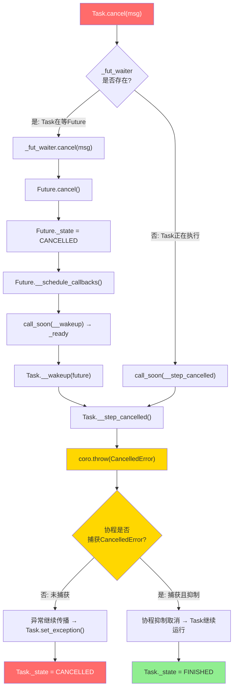

# asyncio 知识地图

## 1. 核心架构图 (ASCII)

```
┌─────────────────────────────────────────────────────────────────────────────┐
│                           asyncio 核心架构                                   │
│                                                                             │
│  ┌───────────────────────────────────────────────────────────────────────┐  │
│  │                       应用层 (Application)                            │  │
│  │   async def main()  ·  async with TaskGroup()  ·  await gather()    │  │
│  └──────────────────────────────┬────────────────────────────────────────┘  │
│                                 │ await / create_task                       │
│  ┌──────────────────────────────▼────────────────────────────────────────┐  │
│  │                     协程调度层 (Coroutine Scheduling)                 │  │
│  │  ┌──────────┐  __step   ┌──────────┐  __wakeup  ┌──────────┐         │  │
│  │  │   Task   │◄─────────┤  Future   │◄──────────┤  Future   │         │  │
│  │  │(主动驱动)│─────────►│(被动锚点) │─────────►│(I/O结果)  │         │  │
│  │  └────┬─────┘  await   └─────┬────┘  callback  └─────┬────┘         │  │
│  │       │                      │                       │               │  │
│  │  ┌────▼─────┐          ┌─────▼────┐            ┌─────▼────┐         │  │
│  │  │ 协程     │  yield   │ add_done │            │set_result│         │  │
│  │  │ coroutine│─────────►│ callback │            │          │         │  │
│  │  └──────────┘          └──────────┘            └─────┬────┘         │  │
│  └──────────────────────────────────────────────────────┼───────────────┘  │
│                                                          │                  │
│  ┌───────────────────────────────────────────────────────▼───────────────┐  │
│  │                      事件循环层 (Event Loop)                          │  │
│  │  ┌─────────────────────────────────────────────────────────────────┐ │  │
│  │  │  _run_once() 循环迭代                                          │ │  │
│  │  │  ┌──────────┐   ┌───────────┐   ┌──────────┐   ┌───────────┐  │ │  │
│  │  │  │ 清理取消  │──►│计算超时    │──►│ selector  │──►│到期定时器  │  │ │  │
│  │  │  │ 定时器    │   │select超时 │   │ .select() │   │→_ready    │  │ │  │
│  │  │  └──────────┘   └───────────┘   └─────┬────┘   └───────────┘  │ │  │
│  │  │                                       │ 就绪fd                   │ │  │
│  │  │                                       ▼                          │ │  │
│  │  │                              ┌──────────────┐                    │ │  │
│  │  │                              │  _ready队列   │◄── call_soon()    │ │  │
│  │  │                              │  [cb, cb, ...]│◄── __schedule_    │ │  │
│  │  │                              └──────┬───────┘    callbacks()     │ │  │
│  │  │                                     │ 逐个执行                   │ │  │
│  │  │                                     ▼                            │ │  │
│  │  │                              handle._run()                       │ │  │
│  │  └─────────────────────────────────────────────────────────────────┘ │  │
│  └───────────────────────────────────────────────────────────────────────┘  │
│                                     │                                       │
│  ┌──────────────────────────────────▼────────────────────────────────────┐  │
│  │                     I/O 桥接层 (Transport / Protocol)                 │  │
│  │  ┌──────────────────────┐         ┌──────────────────────────────┐   │  │
│  │  │    Transport         │ 数据    │    Protocol                  │   │  │
│  │  │  ┌────────────────┐  │────────►│  ┌────────────────────────┐ │   │  │
│  │  │  │_SelectorSocket │  │         │  │ connection_made        │ │   │  │
│  │  │  │   Transport    │  │         │  │    ↓                   │ │   │  │
│  │  │  ├────────────────┤  │         │  │ data_received(data)   │ │   │  │
│  │  │  │ _read_ready()  │◄──selector │  │    ↓                   │ │   │  │
│  │  │  │ _write_ready() │──►sock.send│  │ eof_received()        │ │   │  │
│  │  │  │ write(data)    │  │         │  │    ↓                   │ │   │  │
│  │  │  │ close()        │  │         │  │ connection_lost(exc)  │ │   │  │
│  │  │  └────────────────┘  │         │  └────────────────────────┘ │   │  │
│  │  └──────────────────────┘         └──────────────────────────────┘   │  │
│  └───────────────────────────────────────────────────────────────────────┘  │
│                                     │                                       │
│  ┌──────────────────────────────────▼────────────────────────────────────┐  │
│  │                        内核层 (OS Kernel)                             │  │
│  │    select / epoll / kqueue / IOCP                                    │  │
│  │    non-blocking socket · DNS · file I/O                              │  │
│  └───────────────────────────────────────────────────────────────────────┘  │
└─────────────────────────────────────────────────────────────────────────────┘
```

---

## 2. 演进流图 (Mermaid)

```mermaid
flowchart TD
    N0["<b>N0: 核心冲突</b><br/>CPU与I/O速度鸿沟<br/>串行空转 · GIL限制<br/><i>冲突A1-A4</i>"]

    N1["<b>N1: 时序突破</b><br/>EventLoop接管控制权<br/>轮询→调度→执行<br/><i>实体: EventLoop, Handle,<br/>TimerHandle, _run_once,<br/>_ready, _scheduled,<br/>call_soon/call_later/call_at</i>"]

    N2["<b>N2: 结构突破</b><br/>协程与Task切断栈帧<br/>yield/await暂停·Task驱动<br/><i>实体: Coroutine, Task,<br/>__step, _fut_waiter,<br/>cancel/uncancel</i>"]

    N3["<b>N3: 实体与边界突破</b><br/>Future状态机与回调唤醒<br/>PENDING→FINISHED·回调传播<br/><i>实体: Future, set_result,<br/>set_exception, __schedule_callbacks,<br/>add_done_callback, __await__</i>"]

    N4["<b>N4: 边界闭合</b><br/>Transport/Protocol桥接内核<br/>内核→selector→Transport→Protocol<br/><i>实体: Transport, Protocol,<br/>Selector, _SelectorSocketTransport,<br/>StreamReader/Writer, SSLProtocol</i>"]

    N5["<b>N5: 时序补充</b><br/>同步原语与Queue<br/>协调Task间时序·资源访问<br/><i>实体: Lock, Event, Condition,<br/>Semaphore, Barrier, Queue</i>"]

    N6["<b>N6: 结构化闭环</b><br/>TaskGroup·Timeout·Runner<br/>作用域约束·异常传播·生命周期<br/><i>实体: TaskGroup, ExceptionGroup,<br/>timeout, TimerHandle→cancel,<br/>Runner, asyncio.run()</i>"]

    D1["<b>D1: 时序接管</b><br/>EventLoop轮询调度<br/>替代串行阻塞等待"]
    D2["<b>D2: 结构切断</b><br/>协程yield暂停<br/>Task.__step()驱动"]
    D3["<b>D3: 实体锚定</b><br/>Future状态机<br/>回调通知恢复"]
    D4["<b>D4: 边界桥接</b><br/>Transport封装I/O<br/>Protocol定义逻辑"]
    D5["<b>D5: 时序协调</b><br/>同步原语协调<br/>Task间让出与唤醒"]
    D6["<b>D6: 结构封闭</b><br/>TaskGroup作用域<br/>Timeout边界"]

    N0 -->|D1| N1
    N1 -->|"副作用:<br/>需主动让出控制权"| D2
    D2 -->|突破| N2
    N2 -->|"副作用:<br/>谁来通知恢复?"| D3
    D3 -->|突破| N3
    N3 -->|"副作用:<br/>Future不知内核何时完成I/O"| D4
    D4 -->|突破| N4
    N4 -->|"副作用:<br/>协程间时序协调需求"| D5
    D5 -->|突破| N5
    N5 -->|"副作用:<br/>散养Task缺乏结构化管理"| D6
    D6 -->|突破| N6

    style N0 fill:#ff6b6b,color:#fff
    style N1 fill:#ffa07a,color:#fff
    style N2 fill:#ffd700,color:#333
    style N3 fill:#98fb98,color:#333
    style N4 fill:#87ceeb,color:#333
    style N5 fill:#dda0dd,color:#333
    style N6 fill:#90ee90,color:#333
    style D1 fill:#ff9999
    style D2 fill:#ffcc99
    style D3 fill:#ffff99
    style D4 fill:#99ff99
    style D5 fill:#cc99ff
    style D6 fill:#99ffcc
```



---

## 3. 四维关系矩阵

实体 | N0冲突 | N1时序 | N2结构 | N3边界 | N4边界 | N5时序 | N6结构
---|---|---|---|---|---|---|---
EventLoop | ★★ | ★★★ | ★ | ★ | ★★ | ★ | ★
_run_once | ★ | ★★★ | ★ | ★ | ★ | ★ | ★
Handle | ★ | ★★ | ★ | ★ | ★ | ★ | ★
TimerHandle | ★ | ★★★ | ★ | ★ | ★ | ★ | ★★
_ready | ★ | ★★★ | ★ | ★ | ★ | ★★ | ★
_scheduled | ★ | ★★★ | ★ | ★ | ★ | ★ | ★
call_soon | ★ | ★★★ | ★ | ★ | ★ | ★ | ★
call_later | ★ | ★★★ | ★ | ★ | ★ | ★ | ★
Coroutine | ★★★ | ★★ | ★★★ | ★ | ★ | ★ | ★
Task | ★★ | ★★ | ★★★ | ★★ | ★ | ★★ | ★★★
__step | ★ | ★★★ | ★★★ | ★★ | ★ | ★ | ★
_fut_waiter | ★ | ★★ | ★★★ | ★★ | ★ | ★ | ★
cancel/uncancel | ★ | ★★ | ★★ | ★ | ★ | ★★ | ★★★
Future | ★★ | ★★ | ★★ | ★★★ | ★★ | ★★ | ★★
set_result | ★ | ★ | ★ | ★★★ | ★★ | ★ | ★
__schedule_callbacks | ★ | ★★★ | ★ | ★★★ | ★ | ★ | ★
add_done_callback | ★ | ★★ | ★ | ★★★ | ★★ | ★ | ★
__await__ | ★ | ★★ | ★★★ | ★★★ | ★ | ★ | ★
Selector | ★★★ | ★★★ | ★ | ★ | ★★★ | ★ | ★
Transport | ★★★ | ★★ | ★ | ★ | ★★★ | ★★ | ★
Protocol | ★★ | ★ | ★ | ★ | ★★★ | ★ | ★
StreamReader | ★★ | ★ | ★★ | ★ | ★★ | ★★ | ★
StreamWriter | ★★ | ★ | ★★ | ★ | ★★ | ★★ | ★
SSLProtocol | ★★ | ★ | ★ | ★ | ★★★ | ★ | ★
Lock | ★ | ★ | ★ | ★ | ★ | ★★★ | ★★
Event_sync | ★ | ★ | ★ | ★ | ★ | ★★★ | ★
Condition | ★ | ★ | ★ | ★ | ★ | ★★★ | ★
Semaphore | ★ | ★ | ★ | ★ | ★ | ★★★ | ★
Barrier | ★ | ★ | ★ | ★ | ★ | ★★★ | ★★
Queue | ★★ | ★★ | ★ | ★ | ★ | ★★★ | ★★
TaskGroup | ★ | ★ | ★★ | ★ | ★ | ★★ | ★★★
ExceptionGroup | ★ | ★ | ★★ | ★ | ★ | ★ | ★★★
timeout | ★★ | ★★★ | ★★ | ★ | ★ | ★★ | ★★★
Runner | ★★ | ★★★ | ★★ | ★ | ★ | ★ | ★★★
asyncio.run | ★★ | ★★★ | ★★ | ★ | ★ | ★ | ★★★

### 权重说明
- ★★★: 该实体在此维度具有核心定义性作用
- ★★: 该实体在此维度有显著影响或依赖
- ★: 该实体在此维度有弱关联

### 关键对齐规则
| 突破维度 | ★★★实体(必须对齐) |
|---|---|
| D1时序接管(N0→N1) | EventLoop, _run_once, TimerHandle, _ready, _scheduled, call_soon, call_later |
| D2结构切断(N1→N2) | Coroutine, Task, __step, _fut_waiter, __await__ |
| D3实体锚定(N2→N3) | Future, set_result, __schedule_callbacks, add_done_callback, __await__ |
| D4边界桥接(N3→N4) | Selector, Transport, Protocol, SSLProtocol |
| D5时序协调(N4→N5) | Lock, Event_sync, Condition, Semaphore, Barrier, Queue |
| D6结构封闭(N5→N6) | TaskGroup, ExceptionGroup, timeout, Runner, asyncio.run |

---

## 4. 数据流路径图 (Mermaid)

```mermaid
flowchart LR
    subgraph Kernel["内核空间"]
        NIC["网卡中断"]
        BUF["内核socket buffer"]
    end

    subgraph Selector["I/O多路复用"]
        EP["epoll_wait()/<br/>kqueue()/IOCP"]
        EV["就绪事件<br/>(fd, READ/READY)"]
    end

    subgraph EventLoop["EventLoop"]
        RP["_run_once()"]
        RDY["_ready队列"]
        CB["handle._run()"]
    end

    subgraph Transport["Transport层"]
        RR["_read_ready()"]
        WR["_write_ready()"]
        BUF2["_buffer<br/>(用户态写缓冲)"]
    end

    subgraph Protocol["Protocol层"]
        CM["connection_made()"]
        DR["data_received(data)"]
        CL["connection_lost()"]
    end

    subgraph FutureLayer["Future层"]
        FUT["Future"]
        SR["set_result()"]
        SC["__schedule_callbacks()"]
    end

    subgraph TaskLayer["Task层"]
        WU["__wakeup()"]
        ST["__step()"]
    end

    subgraph Coroutine["协程层"]
        CORO["coroutine"]
        AW["await expr"]
        RES["结果值"]
    end

    NIC -->|"数据到达"| BUF
    BUF -->|"fd可读"| EP
    EP -->|返回| EV
    EV -->|"回调入_ready"| RP
    RP --> RDY
    RDY --> CB
    CB -->|"调用Transport回调"| RR
    RR -->|"sock.recv()"| DR
    DR -->|"业务处理后"| SR
    SR --> FUT
    SR --> SC
    SC -->|"call_soon(cb)"| RDY

    FUT -->|"回调触发"| WU
    WU --> ST
    ST -->|"coro.send(result)"| CORO
    CORO --> AW
    AW --> RES

    style Kernel fill:#ffcccc
    style Selector fill:#ffe0b2
    style EventLoop fill:#fff9c4
    style Transport fill:#c8e6c9
    style Protocol fill:#b3e5fc
    style FutureLayer fill:#d1c4e9
    style TaskLayer fill:#f8bbd0
    style Coroutine fill:#dcedc8
```



### 数据流路径(文字版)

```
内核I/O中断 → socket buffer就绪 → epoll_wait()返回(fd,READ)
→ EventLoop._run_once()处理就绪事件 → _read_ready回调入_ready队列
→ handle._run()执行回调 → Transport._read_ready()
→ sock.recv(BUFFER_SIZE) → data
→ Protocol.data_received(data) → 业务处理
→ Future.set_result(result) → __schedule_callbacks()
→ call_soon(Task.__wakeup, future) → 入_ready队列
→ handle._run() → Task.__wakeup(future) → Task.__step(future)
→ coro.send(future.result()) → 协程恢复 → await表达式返回结果值
```

---

## 5. 取消传播图 (Mermaid)



### 取消传播流程(文字版)

```
Task.cancel(msg) 被调用
  │
  ├─ _fut_waiter 存在 (Task正在await某个Future)
  │   └─ _fut_waiter.cancel(msg)  →  Future状态→CANCELLED
  │       └─ __schedule_callbacks()  →  call_soon(__wakeup)
  │           └─ __wakeup  →  __step()
  │               └─ 检测Future已取消  →  __step_cancelled()
  │
  └─ _fut_waiter 不存在 (Task在_ready队列或正在执行)
      └─ call_soon(__step_cancelled)
          └─ 下次_run_once执行__step_cancelled()

__step_cancelled():
  └─ coro.throw(CancelledError(msg))
      │
      ├─ 协程未捕获  →  异常传播  →  Task.set_exception()  →  Task._state=CANCELLED
      │
      └─ 协程捕获(CancelledError)
          │
          ├─ 抑制取消(不re-raise)  →  Task继续运行  →  _state=FINISHED
          │
          └─ re-raise  →  Task.set_exception()  →  Task._state=CANCELLED
```

### uncancel机制

```
# timeout场景下的取消转换

asyncio.timeout(delay) 注册:
  loop.call_later(delay, task.cancel) → TimerHandle

超时触发时:
  TimerHandle执行 → task.cancel("timeout")
  → CancelledError传播到协程

asyncio.timeout.__aexit__:
  若是超时导致的取消:
    task.uncancel()   # 将CancelledError转换为TimeoutError
    raise TimeoutError  # 替代CancelledError向上传播

关键: uncancel()使 Task取消计数-1
  若取消计数归零 → Task不再被视为"已取消"
  但TimeoutError仍会传播(由timeout.__aexit__抛出)
```
