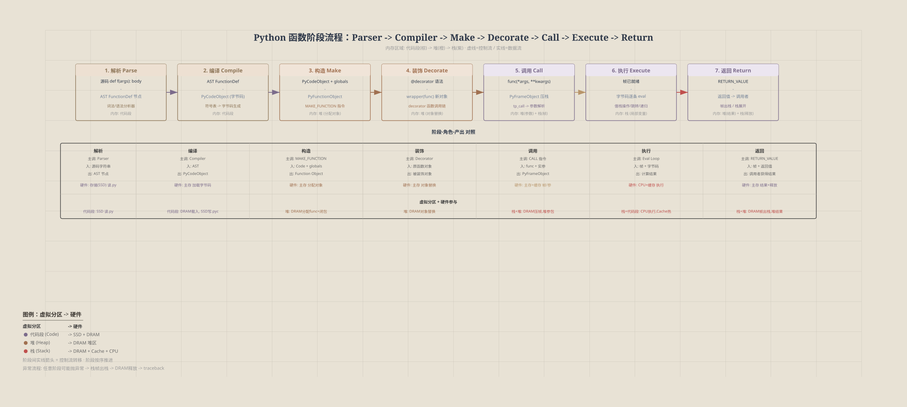
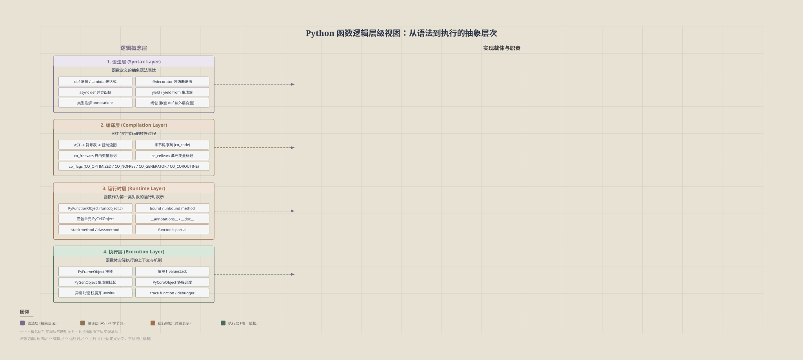

# Python函数核心知识全局视图

> 从 Python 语言层到 CPython 解释器层，覆盖函数从定义到执行销毁的完整生命周期。视角A以虚拟内存分区（代码段/堆/栈）为 y 轴，标注到硬件（SSD/DRAM/Cache/CPU）的映射路径，同时展示内存管理与硬件执行的协作关系。

## 概述

**观察对象**：Python 函数——包括 `def` 定义、`lambda` 表达式、方法、闭包、装饰器、生成器、协程等函数变体。

**坐标轴语义**：
| 视角 | x 轴 | y 轴 | SVG | 描述公式 |
|------|------|------|-----|---------|
| 视角A：2D-CCS | 生命周期（解析&编译→创建&装饰→调用&执行→返回&销毁） | 虚拟内存分区 + 硬件映射（代码段→SSD+DRAM / 堆→DRAM / 栈→DRAM+Cache+CPU） | [svg/function-structure-lifecycle.svg](svg/function-structure-lifecycle.svg) | "谁在某虚拟分区（某硬件）上干了某事" |
| 视角B：阶段流程 | 处理阶段顺序（解析→编译→创建→装饰→调用→执行→返回） | 主调角色/实体（Parser / Compiler / MAKE_FUNCTION / 装饰器 / CALL / Frame） | [svg/function-stage-flow.svg](svg/function-stage-flow.svg) | 每个阶段谁主导、产出什么 |
| 视角C：逻辑层级 | — | 逻辑概念层级（语法层 → 编译层 → 运行时层 → 执行层） | [svg/function-logical-hierarchy.svg](svg/function-logical-hierarchy.svg) | 函数在各抽象层的表示与职责 |

**覆盖范围**：Python 语言语法层（`def`、`lambda`、装饰器、闭包、类型注解） + CPython 解释器层（Code Object / Function Object / Frame Object / 字节码执行）。

---

## 视角A：2D-CCS 坐标系（x=生命周期 × y=虚拟内存分区→硬件）

[](svg/function-structure-lifecycle.svg)

### 全局视野

```
y (虚拟分区 → 硬件映射)
│
│    栈 (→DRAM+Cache+CPU)   ┌──────── 帧入栈执行 ──── 帧出栈释放 ──┐
│    (调用帧/值栈)          │                                       │
│                           │          调用&执行期                   │
│    堆 (→DRAM)             ┌── 函数对象分配 ── 参数闭包读写 ── GC ┤
│    (函数对象/闭包)        │                                       │
│                           │ 解析&编译    创建&装饰                 │
│    代码段 (→SSD+DRAM)     ┌── 字节码编译 ── 常量存储 ── 取指执行 ┤
│    (字节码/常量)          │                                       │
│ ─────────────────────────┼───────────────────────────────────────│─→ x (生命周期)
│                           解析&编译    创建&装饰    调用&执行  返回&销毁
```

### 对象 & 职责（虚拟分区 → 硬件映射）

| 序号 | 虚拟分区 | 硬件路径 | 阶段 | 职责 |
|:-----|:---------|:---------|:-----|:-----|
| A1 | 代码段 | SSD→DRAM | 解析&编译 | `.py` 源码从 SSD 读取；编译后字节码 + 常量表写入 DRAM 代码段；`.pyc` 写回 SSD |
| A2 | 代码段 | DRAM | 创建&装饰 | `co_consts` 默认参数常量驻留在 DRAM 代码段，供 MAKE_FUNCTION 引用 |
| A3 | 代码段 | DRAM→Cache→CPU | 调用&执行 | Eval loop 从 DRAM 代码段取字节码指令 → Cache 预取 → CPU 解码执行 |
| A4 | 堆 | DRAM | 创建&装饰 | PyFunctionObject + PyCellObject（闭包单元）在 DRAM 堆区 `malloc` 分配 |
| A5 | 堆 | DRAM | 调用&执行 | 实参元组、关键字参数字典在 DRAM 堆区分配；闭包单元 `cell_contents` 读写 |
| A6 | 堆 | DRAM | 返回&销毁 | 引用计数归零后，GC 在 DRAM 堆区 `free` 回收函数对象及闭包单元 |
| A7 | 栈 | DRAM | 调用&执行 | PyFrameObject 在 DRAM 栈区压帧；局部变量（`f_localsplus`）和值栈（`f_valuestack`）在栈区分配 |
| A8 | 栈 | DRAM→Cache→CPU | 调用&执行 | 值栈操作数进入 Cache L1/L2 → CPU 寄存器 → ALU 计算 → 写回 DRAM 栈区 |
| A9 | 栈 | DRAM | 返回&销毁 | 帧出栈、DRAM 栈区局部变量及值栈空间回收 |
| A10 | 栈 | CPU | 返回&销毁 | RETURN_VALUE 指令通过 CPU 寄存器将返回值传回调用者栈帧 |

---

## 视角B：阶段流程视图（x=阶段顺序 × y=角色/实体）

[](svg/function-stage-flow.svg)

```
解析期 → 编译期 → 构造期 → 装饰期 → 调用期 → 执行期 → 返回期
  │        │        │        │        │        │        │
  ▼        ▼        ▼        ▼        ▼        ▼        ▼
Parser  Compiler MAKE_FN  Decorator  CALL    Frame   RETURN
```

### 阶段-角色-产出

| 阶段 | 主调角色 | 输入 | 产出 | 关键操作 |
|:-----|:---------|:-----|:-----|:---------|
| 解析 (Parse) | Parser / tokenizer | 源码字符串 `def f(x): return x+1` | AST (FunctionDef 节点) | 词法分析 → 语法分析 → 构建 CST → 转为 AST；区分 `def` / `async def` / `lambda` |
| 编译 (Compile) | Compiler (compile.c) | AST FunctionDef 节点 | PyCodeObject | 生成字节码指令序列（LOAD_FAST、BINARY_ADD、RETURN_VALUE 等）；填充 co_consts、co_varnames、co_names、co_freevars、co_cellvars |
| 构造 (Make) | MAKE_FUNCTION (ceval) | PyCodeObject + globals | PyFunctionObject | `MAKE_FUNCTION` 字节码指令：将 code object + qualified name + defaults + closure 封装为函数对象；设置 __module__、__qualname__、__doc__、__annotations__ |
| 装饰 (Decorate) | 装饰器函数 | 原始函数对象 | 被装饰的函数对象 | `@decorator` 语法在 MAKE_FUNCTION 后立即执行 `decorator(func)`；多层装饰器从内到外逐层应用 |
| 调用 (Call) | CALL / CALL_FUNCTION / PRECALL | PyFunctionObject + 实参 | PyFrameObject | 参数解析（位置/关键字/默认/可变/*/**）、类型检查、帧分配；闭包变量注入 |
| 执行 (Execute) | Frame eval loop | PyFrameObject | 计算结果 | 字节码逐条执行：值栈操作、局部变量读写、控制流跳转、函数调用递归压帧；异常捕获与栈展开 |
| 返回 (Return) | RETURN_VALUE / RETURN_GENERATOR | 帧状态 + 返回值 | 调用者的结果 | 帧出栈；返回值传递给调用者指令栈；生成器/协程特殊处理（不销毁帧，挂起等待 send/throw） |

---

## 视角C：逻辑概念层级视图（y=逻辑概念层级）

[](svg/function-logical-hierarchy.svg)

```
┌──────────────────────────────────────────────┐
│  语法层 (Syntax Layer)                        │
│  def, lambda, @decorator, async def, yield,  │
│  annotations, type hints, -> return type     │
│  闭包语法（嵌套def读外层变量）                 │
├──────────────────────────────────────────────┤
│  编译层 (Compilation Layer)                   │
│  AST → Symbol Table → CFG → Bytecode         │
│  co_freevars / co_cellvars 标记自由/单元变量  │
│  co_flags 标记 (CO_OPTIMIZED/CO_NOFREE/...)   │
├──────────────────────────────────────────────┤
│  运行时层 (Runtime Layer)                      │
│  PyFunctionObject: __code__ __globals__       │
│  __defaults__ __kwdefaults__ __closure__      │
│  __dict__ __annotations__ __name__ __module__ │
│  bound method / unbound method                │
│  partial / staticmethod / classmethod         │
├──────────────────────────────────────────────┤
│  执行层 (Execution Layer)                      │
│  PyFrameObject: f_locals f_globals f_builtins │
│  f_code f_lasti f_lineno f_back f_valuestack  │
│  PyGenObject / PyCoroObject (暂停/恢复)        │
│  trace function / profiler / debugger hook    │
└──────────────────────────────────────────────┘
```

### 层级-概念-载体

| 层级 | 核心概念 | Python 载体 | CPython 实体 |
|:-----|:---------|:-----------|:------------|
| 语法层 | 函数定义 | `def f(args): body` | AST `FunctionDef` 节点 |
| 语法层 | 匿名函数 | `lambda args: expr` | AST `Lambda` 节点 |
| 语法层 | 装饰器 | `@wrapper` | `ast.Call(wrapper, func)` 等价语法糖 |
| 语法层 | 异步函数 | `async def` | AST `AsyncFunctionDef`，`CO_COROUTINE` 标记 |
| 语法层 | 生成器函数 | `def f(): yield` | AST 含 `Yield` 节点，`CO_GENERATOR` 标记 |
| 语法层 | 闭包 | 嵌套 `def` 读外层变量 | `co_freevars` 在编译期标记 |
| 编译层 | 符号表 | `__code__.co_varnames` | `symtable.c` 构建作用域符号表 |
| 编译层 | 字节码 | `dis.dis(func)` | `co_code` 字节码序列 (2 bytes/instruction in 3.6+) |
| 编译层 | 常量表 | `__code__.co_consts` | 包含 None、字面量、内嵌 code object、docstring |
| 运行时层 | 函数对象 | `types.FunctionType` | `PyFunctionObject` (funcobject.c) |
| 运行时层 | 绑定方法 | `obj.method` → bound method | `PyMethodObject` (classobject.c) |
| 运行时层 | 闭包单元 | `__closure__` tuple of cell | `PyCellObject`：`cell_contents` 可变引用 |
| 运行时层 | 类型注解 | `__annotations__` dict | 函数 `__annotations__` 属性（字符串化在 `__future__.annotations` 下不同） |
| 执行层 | 栈帧 | `inspect.currentframe()` | `PyFrameObject` / `_PyInterpreterFrame` (3.11+) |
| 执行层 | 值栈 | — | `f_valuestack`：字节码执行的操作数栈 |
| 执行层 | 生成器对象 | `gen = f()` 返回 generator | `PyGenObject`：持有帧引用，`gi_frame` / `gi_code` / `gi_running` |
| 执行层 | 协程对象 | `coro = f()` 返回 coroutine | `PyCoroObject`，`await` 驱动状态机 |
| 执行层 | 异常处理 | `try/except/finally` in def | 块栈 `f_blockstack` + `SETUP_FINALLY` / `POP_BLOCK` 指令 |

---

## 协作关系图

```
                        @decorator ──► PyFunctionObject
                              │
                              ▼
   source ──► Parser ──► AST ──► Compiler ──► PyCodeObject
                                                    │
                                                    ▼
   caller ──► CALL ──► argument parsing ──► MAKE_FUNCTION ──► PyFunctionObject
                                                                     │
                                                                     ▼
                                                         PyFrameObject (new frame)
                                                                     │
                                                                     ▼
                              ┌────────────────────── frame eval loop ──────────────────────┐
                              │                                                              │
                              ▼                                                              ▼
                        字节码执行                              ┌─── RETURN_VALUE ──► return to caller
                       (值栈操作/                                │
                        跳转/                                    ├─── YIELD_VALUE ──► 挂起到 PyGenObject
                        CALL递归)                                │
                                                                 ├─── raise exception ──► 栈展开 / traceback
                                                                 │
                                                                 └─── await / yield from ──► 协程调度
```

---

## 关键数据结构

### PyCodeObject 核心字段
| 字段 | 含义 |
|:-----|:-----|
| `co_code` | 字节码指令序列 |
| `co_consts` | 常量元组（None、字面值、内嵌 code object） |
| `co_names` | 全局/属性名称元组 |
| `co_varnames` | 局部变量名元组（含参数） |
| `co_freevars` | 自由变量名元组（来自外层作用域） |
| `co_cellvars` | 单元变量名元组（被内层函数引用） |
| `co_argcount` | 位置参数数量（不含 *args, **kwargs） |
| `co_kwonlyargcount` | keyword-only 参数数量 |
| `co_nlocals` | 局部变量总数 |
| `co_stacksize` | 所需值栈深度 |
| `co_firstlineno` | 函数定义首行号 |
| `co_lnotab` / `co_linetable` (3.10+) | 行号映射表 |
| `co_flags` | 标志位（CO_OPTIMIZED / CO_NOFREE / CO_GENERATOR / CO_COROUTINE 等） |

### PyFunctionObject 核心字段
| 字段 | 含义 |
|:-----|:-----|
| `func_code` (`__code__`) | PyCodeObject 引用 |
| `func_globals` (`__globals__`) | 全局命名空间 dict |
| `func_defaults` (`__defaults__`) | 默认参数值元组 |
| `func_kwdefaults` (`__kwdefaults__`) | keyword-only 默认值 dict |
| `func_closure` (`__closure__`) | 闭包单元元组 (PyCellObject) |
| `func_doc` (`__doc__`) | 文档字符串 |
| `func_name` (`__name__`) | 函数名 |
| `func_qualname` (`__qualname__`) | 完全限定名 |
| `func_module` (`__module__`) | 模块名 |
| `func_annotations` (`__annotations__`) | 类型注解 dict |
| `func_dict` (`__dict__`) | 函数属性 dict |

### PyFrameObject 核心字段
| 字段 | 含义 |
|:-----|:-----|
| `f_back` | 上一帧（调用者） |
| `f_code` | 执行的 PyCodeObject |
| `f_locals` | 局部命名空间 |
| `f_globals` | 全局命名空间 |
| `f_builtins` | 内建命名空间 |
| `f_lasti` | 最后执行的指令索引 |
| `f_lineno` | 当前行号 |
| `f_trace` / `f_trace_lines` / `f_trace_opcodes` | 调试/追踪钩子 |
| `f_valuestack` | 值栈（字节码操作数） |
| `f_localsplus` | locals + cellvars + freevars + stack (3.11+) |

---

## 特殊函数类型与机制

| 类型 | 标记/特征 | 行为差异 |
|:-----|:---------|:---------|
| 普通函数 | — | 标准调用-执行-返回 |
| 生成器函数 | `yield`, `CO_GENERATOR` | 调用返回 PyGenObject，不执行 body；`send()`/`next()` 驱动执行；YIELD_VALUE 挂起帧 |
| 异步函数 | `async def`, `CO_COROUTINE` | 调用返回 PyCoroObject；`await` 挂起等待 |
| 异步生成器 | `async def` + `yield`, `CO_ASYNC_GENERATOR` | 调用返回 async_generator；`async for` 驱动 |
| `lambda` | 无 `__qualname__`(仅 `<lambda>`), `def` 语法糖 | 表达式 body，隐式 return |
| 绑定方法 | `__self__` 持有实例 | 自动传入 self；`obj.method` 每次创建新 bound method |
| `staticmethod` | descriptor `__get__` 返回原函数 | 不绑定实例；`cls.method` 和 `obj.method` 等价 |
| `classmethod` | descriptor `__get__` 绑定 cls | 传入类而非实例；`obj.method` → `type(obj).method` |
| `functools.partial` | 部分应用参数 | `func`/`args`/`keywords` 属性，`__call__` 合并参数后调用 |

---

## 闭包机制

```
outer()
  │
  ├── var = "hello"          ← cellvar (被内层引用)
  │
  ├── def inner():           ← freevar in inner
  │       print(var)
  │
  └── return inner           ← __closure__ = (cell(var),)
         │
         ▼
  PyFunctionObject(inner)
    func_closure ──► (PyCellObject(cell_contents="hello"),)
```

- `co_cellvars`：编译期 outer 函数标记哪些局部变量被子作用域引用
- `co_freevars`：编译期 inner 函数标记哪些变量来自外层作用域
- `PyCellObject`：可变单元格，允许多个闭包共享同一个外层变量引用
- `LOAD_DEREF` / `STORE_DEREF`：字节码通过 cell 间接读写

---

## 字节码指令速查（函数相关核心指令）

| 指令 | 操作 | 说明 |
|:-----|:-----|:-----|
| `MAKE_FUNCTION` | 从 code object 创建函数 | 栈上有 code + qualified name + defaults + closure |
| `CALL` / `CALL_FUNCTION` | 调用函数 | 参数解析 + 帧创建 |
| `RETURN_VALUE` | 返回 | 弹出帧，返回值压入调用者栈 |
| `YIELD_VALUE` | 生成器暂停 | 返回当前值，保留帧状态 |
| `LOAD_GLOBAL` | 加载全局变量 | 从 `f_globals` / `f_builtins` 查找 |
| `LOAD_FAST` | 加载局部变量 | 从 `f_localsplus` 直接索引 |
| `STORE_FAST` | 存储局部变量 | 写入 `f_localsplus` |
| `LOAD_DEREF` | 加载闭包变量 | 通过 cell 间接读取 |
| `STORE_DEREF` | 存储闭包变量 | 通过 cell 间接写入 |
| `LOAD_CLOSURE` | 加载闭包单元 | 为 MAKE_FUNCTION 准备 closure |
| `SETUP_FINALLY` | 设置异常处理块 | 注册 try block |
| `POP_BLOCK` | 弹出块 | 退出 try/loop/with 块 |
| `GEN_START` | 生成器初始化 | 标记生成器已启动 |
| `YIELD_FROM` | 委托子生成器 | 双向通道：send/throw/close 透传 |

---

## Python 版本差异摘要

| 版本 | 关键变化 |
|:-----|:---------|
| 3.6 | 字节码改为 wordcode（每条指令 2 字节）；`MAKE_FUNCTION` 引入；新增 `CALL_FUNCTION` 系列 |
| 3.7 | `async`/`await` 成为保留关键字；contextvars 支持 |
| 3.8 | `POSITIONAL_ONLY` 参数 (`/`)；`:=` walrus 在函数内可用 |
| 3.9 | `CALL_FUNCTION` 被 `CALL_FUNCTION_EX` 改造；`vectorcall` 协议 |
| 3.10 | `co_lnotab` → `co_linetable`（压缩行号表）；PEP 626 精确行号 |
| 3.11 | 帧对象改为 `_PyInterpreterFrame`（惰性创建）；`CALL` 指令取代多种 CALL 变体；自适应特化 |
| 3.12 | `YIELD_VALUE` + `RESUME` → 生成器 resume 机制重构；comprehensions inlining |
