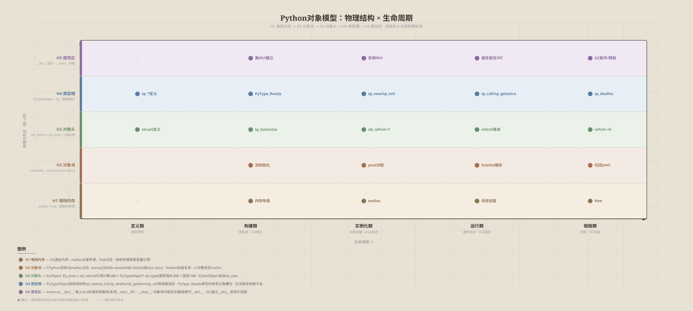

# Python对象模型全局视图：物理结构、实例快照 × 生命周期

## 概述

Python 一切皆对象。本视图从两个完全独立的观察角度提供全景：

| 视角 | y 轴 | x 轴 | SVG | 核心问题 |
|:---|:---|:---|:---|:---|
| **读法 A** | 物理结构 (H1→H5) 真实物理实体 | 生命周期 (5阶段) | [视图A](../../svg/python-object-model-physical.svg) | 在每个阶段，哪些物理内存区域参与？ |
| **读法 B** | 实例快照 (H1→H5) 层即快照 | 生命周期 (5阶段) | [视图B](../../svg/python-object-model-snapshot.svg) | 在每个阶段，实例在各层是什么样？ |

> 读法 B 中 H1 CPython运行时 → H2 元类型根 → H3 元类层 → H4 类层 → H5 实例层 自底向上依次穿透，每一层即为实例在那一时刻的快照形态。

## 读法 A：物理结构 × 生命周期

| 物理层 \ 阶段 | 定义期 | 构建期 | 实例化期 | 运行期 | 销毁期 |
| :--- | :--- | :--- | :--- | :--- | :--- |
| **H5 属性区** | — | class __dict__ (mappingproxy) 建立 | instance.__dict__ 就位 或 __slots__ 内联数组初始化 | 属性查找遍历 __dict__ / slots; GC 通过 __dict__ 发现引用链 | __dict__ 释放; GC 断开引用链 |
| **H4 类型槽** | PyTypeObject 结构在 `typeobject.c` 中定义 tp_new/tp_init/tp_dealloc/tp_call 等函数指针 | PyType_Ready 填充槽位、继承父类槽、计算 MRO、设置 tp_basicsize | tp_new 调用 → tp_init 调用 | tp_getattro/tp_setattro 属性访问; tp_call 方法调用; tp_repr/tp_str 展示 | tp_dealloc 被调用释放对象 |
| **H3 对象头** | PyObject struct 在 `object.h` 定义 16B 标头 (ob_refcnt + ob_type) | tp_basicsize 决定对象体大小 | ob_refcnt=1; ob_type = &PyFoo_Type | ob_refcnt 增减反映引用变化; ob_type 用于方法查找分派 | ob_refcnt→0 触发 tp_dealloc |
| **H2 对象池** | obmalloc arena/pool/block 设计定义于 `obmalloc.c` | 类型就绪时初始化对应 size class 的 pool / freelist | _PyObject_Malloc 从对应 size class 的 pool 取 block | freelist 缓存回收对象加速复用，小对象不走系统 malloc | _PyObject_Free 归还 block 到 pool 或 freelist |
| **H1 堆栈内存** | — | CPython 进程内存布局就绪 | malloc / _PyObject_Malloc 最终从 OS 堆中申请虚拟内存页 | 栈帧持有局部变量指针指向堆中对象; CPU 通过地址访问驻留内存 | free 归还内存; 虚拟内存页可能被 OS 回收 |

## 读法 B：实例快照 × 生命周期

[视图](../../svg/python-object-model-snapshot.svg)

| 快照 \ 阶段 | 定义期 | 构建期 | 实例化期 | 运行期 | 销毁期 |
| :--- | :--- | :--- | :--- | :--- | :--- |
| **H5 实例层** | — | — | instance.__dict__ 就位, 方法绑定为 bound method, ob_type→类 | `a.x` → `type(a).__getattribute__(a,'x')` 对外服务 | __dict__ 释放; __del__ 至多调用一次 |
| **H4 类层** | — | class body 执行; __dict__/MRO/__slots__/descriptor 就位 | __new__ 分配 + __init__ 填充属性 | __getattribute__ → MRO → descriptor → __dict__ → __getattr__ 查找链 | class.__del__ 析构 |
| **H3 元类层** | class Foo(metaclass=Meta): 声明 | __prepare__ → __new__ → __init_subclass__ → __set_name__ 工厂执行 | metaclass.__call__ 控制创建管线 | __call__ 单例/注册拦截; ABCMeta 虚拟子类 | metaclass.__del__ 类级清理 |
| **H2 元类型根** | object/type 解释器启动创建 | type.__new__ C3线性化生成 MRO | type.__call__ 驱动 __new__→__init__ 链 | object.__getattribute__ 默认属性解析器 | object.__del__ |
| **H1 CPython运行时** | PyObject 头文件定义 | PyType_Ready 初始化 tp_* 槽位 | tp_new 分配 PyObject 内存, ob_refcnt=1 | tp_getattro / tp_call 服务 | tp_dealloc + GC 分代回收 |

## 对象清单
| 序号 | 对象 | 所属区域 | 核心职责 | 来源 |
| :--- | :--- | :--- | :--- | :--- |
| 1 | PyObject | 对象头 | C级对象头: ob_refcnt 引用计数 + ob_type 类型指针 | `Include/object.h:106-115` |
| 2 | PyTypeObject | 类型槽 | C级类型结构: tp_new/tp_init/tp_dealloc/tp_getattro 等函数槽 | `Include/cpython/object.h` |
| 3 | 引用计数 (ob_refcnt) | 对象头 | 即时回收: 引用归零 → tp_dealloc | `Include/object.h`; `Objects/object.c` |
| 4 | GC 分代回收 | 属性区 | 循环引用检测: 三代分代扫描, gc 模块触发 | `Modules/gcmodule.c` |
| 5 | obmalloc | 对象池 | CPython 自定义内存分配器: arena→pool→block, freelist | `Objects/obmalloc.c` |
| 6 | type | 类型槽 | 元类型根: type(type)==type, __call__ 驱动实例化, __new__ 驱动类构建 | `Objects/typeobject.c:type_new` |
| 7 | object | 类型槽 | 所有类的基类: 提供默认 __getattribute__/__str__/__repr__/__del__ | `Objects/object.c` |
| 8 | metaclass | 逻辑层 | 类的工厂: 控制类创建(__prepare__/__new__/__init__)与实例创建(__call__) | PEP 3115 |
| 9 | class | 属性区 | 用户自定义类: class body 执行产物, 持有 MRO/描述符/方法 | `class` 语句 |
| 10 | class __dict__ (mappingproxy) | 属性区 | 类命名空间: 存放方法对象、类属性、描述符实例 | 类对象自带 |
| 11 | MRO (C3线性表) | 类型槽 | 方法解析顺序: 构建期计算, 运行期遍历, 存于 type.__mro__ | `Objects/typeobject.c:mro_internal` |
| 12 | __slots__ 成员描述符 | 属性区 | 替代实例 __dict__: 类级描述符直接读写 C 偏移, 节省内存 | §3.3.2.4 |
| 13 | descriptor (property/自定义) | 属性区 | 属性控制: __get__/__set__/__delete__ 拦截访问, property 基于此 | §3.3.2 数据模型 |
| 14 | instance | 属性区 | 用户创建的对象: ob_type 指向类, __dict__ 存储属性 | 每次 `ClassName()` |
| 15 | instance __dict__ | 属性区 | 实例属性存储: __init__ 填充, 无 __slots__ 时存在 | 实例自带 |
